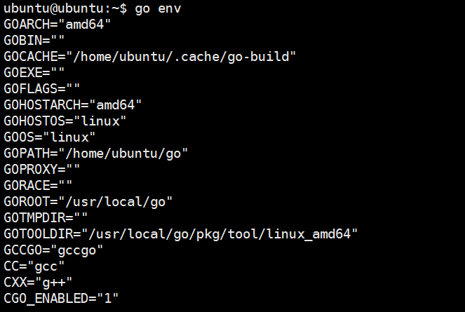
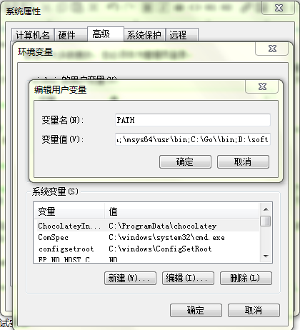
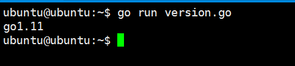

# 2.2 安装 Golang

## 2.2.1 下载 Golang 二进制安装包

官方下载地址，在 https://golang.org/dl/ (如果打不开可以使用这个地址：https://golang.google.cn/dl/) 由于众所周知的原因可能大家不能下载成功，国内也有Golang 安装包的镜像网站 https://studygolang.com/dl 大家也可以从这里下载，不过推荐还是从官方下载最新的安装包。

## 2.2.2 安装 Golang

**Linux 下进行安装**
	
下载完成 Golang 安装包，我们将它解压到 `/usr/local` 目录之下，执行命令：

`tar -C /usr/local -xzf go$VERSION.$OS-$ARCH.tar.gz` 

（注意该命令需要 root 权限，或者用 `sudo` 执行 ）
    
比如你的操作系统是 Ubuntu 64位，你想安装 Golang 1.11.4 版本那么执行：

`sudo tar -C /usr/local -xzf go1.11.4.linux-amd64.tar.gz`

**Window 安装**

如果你下载的是`MSI`版本的安装程序，直接双击安装，Golang 会默认安装在 `c:/go`,
	如果你下载的是`zip`压缩文件，那么解压到 'c:/go' 就好了。 

### 2.2.3 设置 Go 环境变量

**Linux 下进行设置**

我们在 Linux 系统下一般通过文件 `$HOME/.bashrc` 配置自定义环境变量，根据不同的发行版也可能是文件 `$HOME/.profile`，然后使用 gedit 或 vim/vi 来编辑文件内容。

	export PATH=$PATH:/usr/local/go/bin

在开发 Go 项目时，你还需要一个环境变量来保存你的工作目录（PS: Golang 1.11 不需要设置这个变量，默认在 `$HOME/go`）。

	export GOPATH=$HOME/Go

`$GOPATH` 可以包含多个工作目录，取决于你的个人情况。如果你设置了多个工作目录，那么当你在之后使用 `go get`（远程包安装命令）时远程包将会被安装在第一个目录下。

在完成这些设置后，你需要在终端输入指令 `source .bashrc` 以使这些环境变量生效。然后重启终端，输入 `go env` 和 `env` 来检查环境变量是否设置正确。

**Windows 下进行设置**

Windows 右键计算机->属性->高级系统设置->高级->环境变量进行设置。

### 2.2.4 测试安装

用编辑器输入以下内容，并保存为文件名 `hello.go`。

	package main
		
	func main() {
		println("Hello world !")
	}

执行指令 `go run hello.go`，将会打印信息：`Hello world !`。

**验证安装版本**

你可以通过在终端输入指令 `go version` 来打印 Go 的版本信息。

如果你想要通过 Go 代码在运行时检测版本，可以通过以下代码实现。

	//version.go
	package main

	import (
		"fmt"
		"runtime"
	)

	func main() {
		fmt.Printf("%s\n", runtime.Version())
	}

这段代码将会输出 `go1.11` 或类似字符串。

## 2.2.3 安装 git

Centos 下安装：

	$ sudo yum install git

Ubuntu 下安装：

  	$ sudo apt install git

在Windows上安装Git也有几种安装方法。官方版本可以在Git官方网站下载。打开http://git-scm.com/download/win ,下载会自动开始。要注意这是一个名为Git for Windows的项目（也叫做msysGit），和Git是分别独立的项目。
	

## 链接

- [目录](SUMMARY.md)
- 上一节：[Go 环境变量](02.1.md)
- 下一节：[安装 IPFS](02.3.md)
