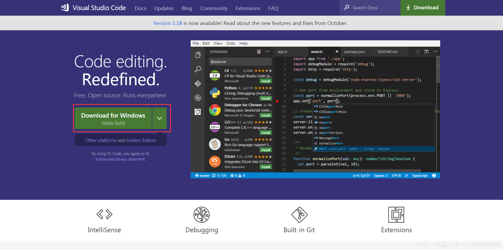
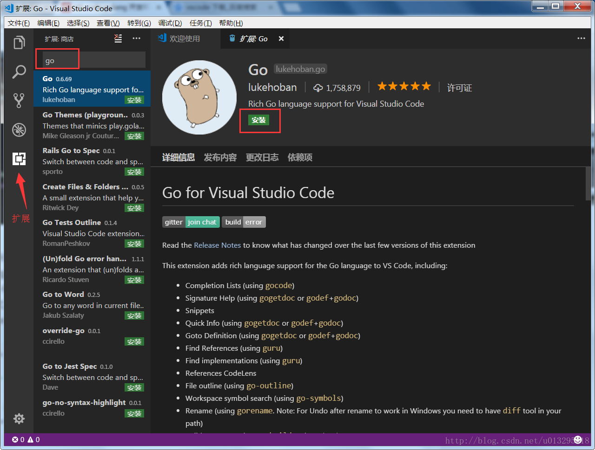
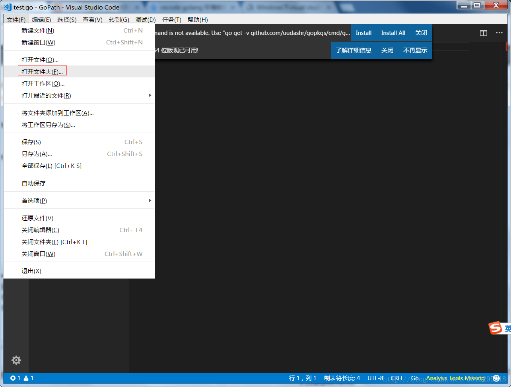
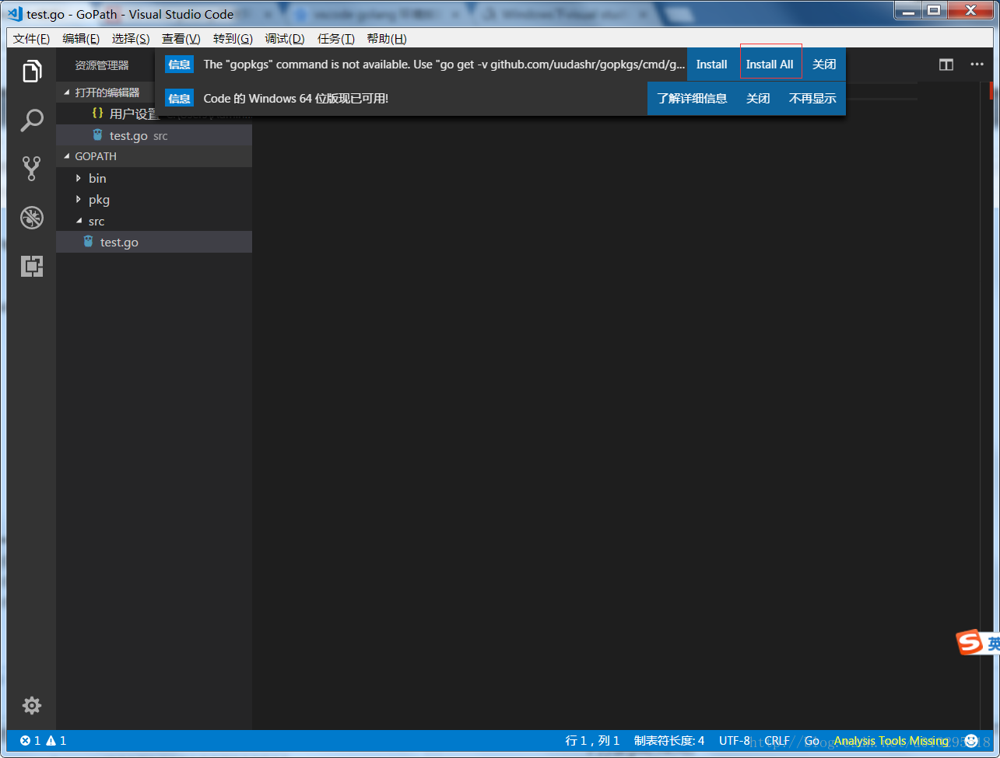
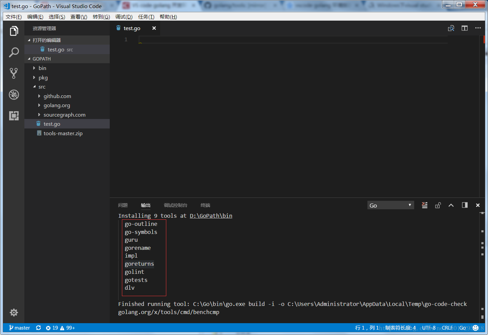
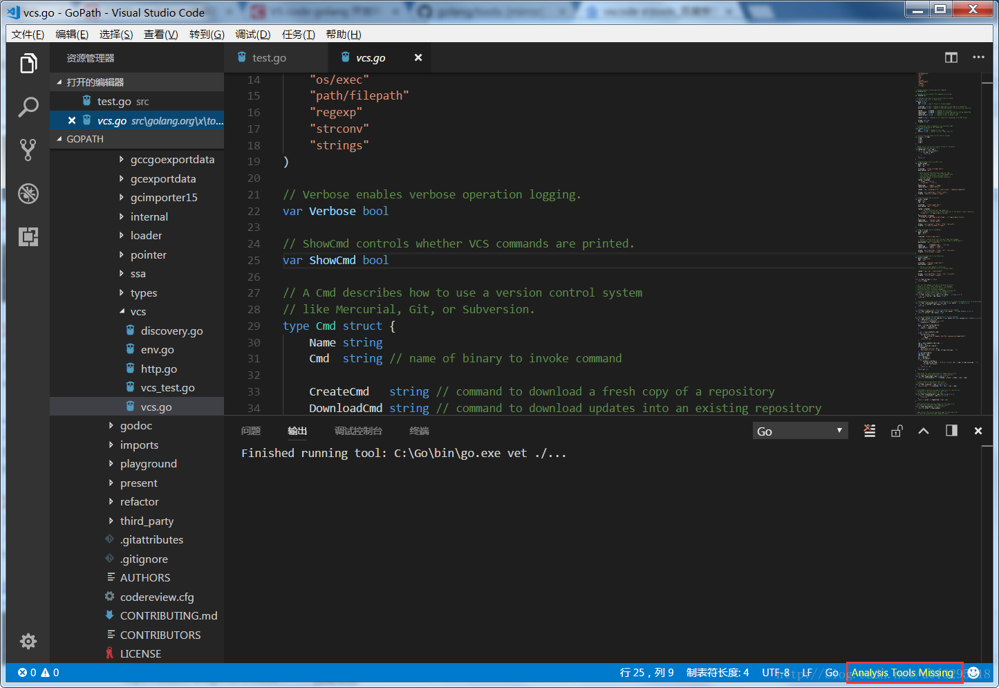
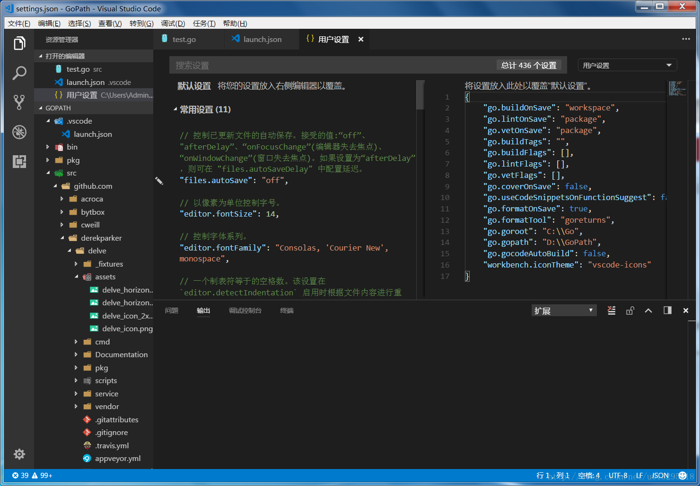
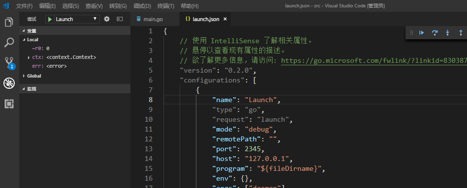
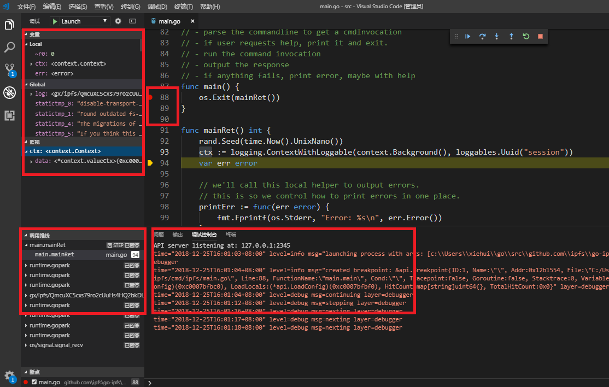

# 2.4 配置 IPFS 开发环境

Golang 开发有许多 ide 工具，这里我们采用的是微软的 Visual Studio Code。

## 2.4.1 安装 VS Code

1. 下载 VS Code ， [下载地址](https://code.visualstudio.com/)

2. 安装 Golang 插件 
启动 vscode 选择插件->搜 `go` 选择 `Go for Visual Studio Code` 插件点击安装即可。如图： 

3. 点击文件菜单 -> 打开文件夹，选择 gopath目录，如下:

## 2.4.2 自动安装go工具包

+ 在 path 目录下的 src 目录中新建`test.go`文件，然后双击打开，VS Code 会提示安装`gopkgs`，选择`Install all`，等待安装结束。

+ 安装过程中有几个包安装失败，如图：

+ 重启 VS Code，点击`Analysis Tools Missing`右下角继续之前安装失败的 go 包，如图：

## 2.4.3 VS Code 自动安装失败，执行手动安装

1. 先在`%GOPATH%\src\golang.org\x`目录下打开`git bash`，执行`git clone http://github.com/golang/tools`。必须用`git`来`clone`，否则安装其他组件如`go get -u -v github.com/cweill/gotests`。会出现`package golang.org/x/tools/imports:directory"D:\\GoPath\\src\\golang.org\\x\\tools\\imports" is not using a known version control system`错误。
2. tools 下载好后，进入`%GOPATH%\src\golang.org\x\tools\cmd\gorename`目录，按`shift+右键`选择在此打开命令窗口，执行`go install`，guru 也执行同样操作。
3. 在命令行窗口执行`go get -u -v github.com/newhook/go-symbols`，安装`go-symbols`。其他几个同样执行此操作，包链接见下。
4. 如果出现`package golang.org/x/tools/go/buildutil: cannot download，http://github.com/golang/tools uses insecure protocol`错误，不难看出是下载 tools 导致，由于我们上边已经安装 tools 而且此时 goo-symbols 已经通过`go get`下来，此时我们直接进入`%GOPATH%\src\github.com\newhook\go-symbols`目录，进入命令行执行`go install`，安装成功`go-symbols.exe`已出现在`%GOPATH%\bin`目录。
5. 错误`pkg\proc\disasm.go:9:14: undefined: ArchInst`，由于 dlv 仅支持 x64 位 go，安装失败。

## 2.4.4 安装包链接
	
	go get -u -v github.com/bytbox/golint 
	go get -u -v github.com/golang/tools 
	go get -u -v github.com/lukehoban/go-outline 
	go get -u -v github.com/newhook/go-symbols 
	go get -u -v github.com/josharian/impl 
	go get -u -v github.com/sqs/goreturns 
	go get -u -v github.com/cweill/gotests

## 2.4.5 安装vscode icons

+ vscode-icons，可以为 VS Code 里的不同文件类型提供相应的图标
+ 在 VS Code 的插件中搜索 `vscode-icons`，安装即可。
+ 安装之后如果 icons 为正确显示，按`F1->`输入`icons`选择激活`Vscode Icons`。
+ icons 启动后，界面如下： 

## 2.4.6 启动调试

选择-> 调试打开配置-> 编辑 `launch.json` 编辑 `args` 这一行, 第一次如果你想调试 `init` 的执行流程就设置为`init`, 想观察 ipfs 执行流程可以设置为 `daemon`, 大家可以自行根据想调试的流程进行设置

    ....
	"args": ["init"], // ["daemon"]
    ....

设置好配置之后，我们双击源代码，加上断点之后，选择 `F5`进行调试。

调试环境设置后之后，我们就可以愉快的进入到 IPFS 底层原理的学习，在下一讲中我们会先去熟悉一下 IPFS 用到的一些底层技术。

## 链接

- [目录](SUMMARY.md)
- 上一节：[安装 IPFS](02.3.md)
- 下一部分：[IPFS 底层技术](03.0.md)