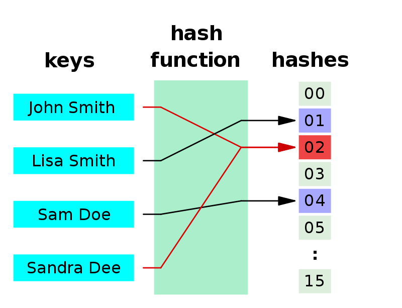
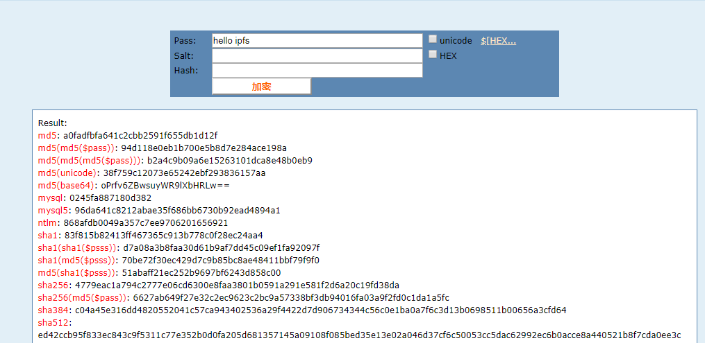
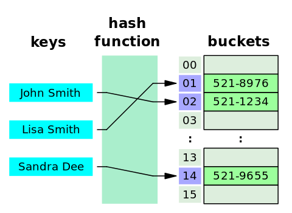
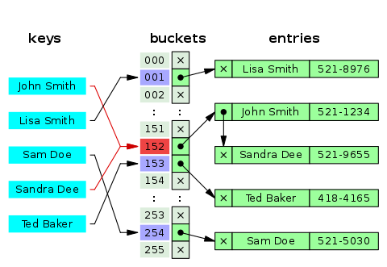
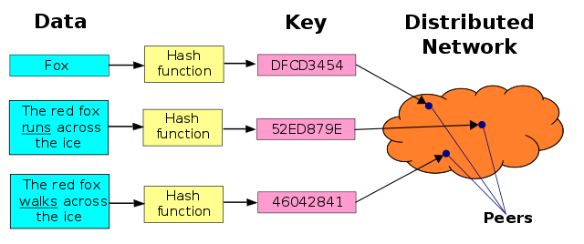
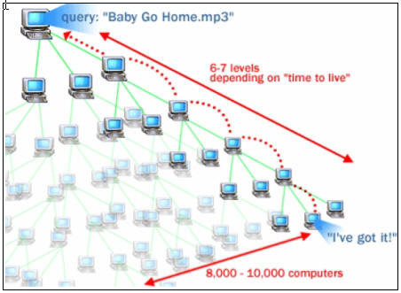

# 3.1 分布式哈希表（DHT）

## 3.1.1 哈希（Hash）

通过将任意长度的二进制数据映射为较短的固定长度的二进制值，即哈希值。这个过程叫做Hash，这个映射函数称做哈希函数（Hash Funtion）。

我们都学过函数`y=f(x)`,对应到哈希函数，输入任意值`x`，进过函数`f`（在这里就是哈希函数）的运算，得到一个`y`（在这里也叫哈希值）。

大家可以去网站 `https://www.cmd5.com/` 尝试用不同的哈希函数数据，观察下对应的哈希值，
比如我们对字符串`hello ipfs` 进行哈希运算:

## 3.1.2 哈希表（Hash Table）

**哈希表**是用来存储键值对（key/value pairs，K/V）的一种容器,有了哈希表，可以很方便快速地通过`key`来获得`value`,比如 Java 中的`HashMap/HashTable`。

比如：手机通讯簿可以通俗理解成一个散列表。里面的每一条记录都包含“姓名”和“电话号码”。“姓名”相当于“键值对”中的`key`，电话号码相当于`value`。你可以通过姓名方便地查找出电话号码。

## 3.1.3 如何实现散列表

在哈希表这种数据结构中，会包含 N 个 `bucket`（桶）。于是可以对每个桶进行编号，从 0 到 N-1。

“桶”是用来存储“键值对”的，你可以把它通俗理解成一个动态数组，里面可以存放【多个】“键值对”。

下面这张图展示了哈希表的查询原理。当使用某个`key`进行查找，会先用某个哈希函数计算这个`key `的哈希值。得到哈希值通常是一个整数，然后用哈希值对`N（桶数）`进行**取模**运算，就可以算出对应的桶编号。（注：取模运算是最常用的做法，但不是唯一的做法）

## 3.1.4 哈希冲突

当两个不同的`key`进行哈希计算却得到**相同**的哈希值，就是所谓的哈希函数碰撞。一旦出现这种情况，这两个`key`对应的两个键值对就会被存储在**同一个**桶（bucket）里面。

另一种情况是：虽然计算出来的哈希值**不同**，但经过取模运算之后却得到**相同**的桶编号。这时候也会出现：两个键值对存储在一个桶里面。

如果某个哈希表在存储数据时完全没有碰撞，那么每个桶里面都只有0个或1个键值对。查找起来就非常快。反之，如果某个哈希表在存储数据时出现严重碰撞，就会导致某些桶里面存储了大量的键值对。将来查找`key`的时候，如果定位到的是这种“大桶”，就需要在这个桶里面逐一比对`key`是否相同——查找效率就会变得很差。

## 3.1.2 什么是分布式散列表（DHT）

分布式哈希表（distributed hash table，DHT）在概念上类似与传统的“哈希表”，差异在于“传统的哈希表”主要是用于单机上的某个软件中，分布式哈希表主要是用于分布式系统（此时，分布式系统的节点可以通俗理解为散列表中的 bucket）。分布式哈希表主要是用来存储大量的（甚至是海量的）数据。在实际使用场景中，直接对所存储的每一个业务数据计算散列值，然后用散列值作为`key`，业务数据本身是`value`。

## 3.1.3 DHT 出现原因

在 P2P 文件共享的发展史上，出现过3种不同的技术路线（三代）。

+ 第1代
	+ 采用中央服务器的模式：每个节点都需要先连接到中央服务器，然后才能查找到自己想要的文件在哪里。
	+ 缺点是——中央服务器成为整个`P2P`网络的单点故障。
	+ 典型代表是 Napster。
+ 第2代
	+ 采用广播的模式: 要找文件的时候，每个节点都向自己相连的所有节点进行询问；被询问的节点如果不知道这个文件在哪里，就再次进行“广播”......如此往复，直至找到所需文件。
	+ 最大缺点是——会引发**广播风暴**并严重占用网络带宽，也会严重消耗节点的系统资源。即使在协议层面通过设置 `TTL（time to live）`，限制查询过程只递归`N`轮，依然**无法**彻底解决此弊端。
	+ 因为这种手法太吓人，获得“Query Flooding”的绰号。下面放一张示意图:

+ 第3代
	+ DHT：解决单点故障和广播风暴的问题

## 3.1.4 DHT 需要解决的问题

### 无中心导致的难点

为了解决前面两代 P2P 技术的缺陷。其中一个缺陷是中央服务器导致的单点故障。因此 DHT 就不能再依靠中央服务器。而没有了中央服务器，就需要提供一系列机制来实现节点之间的通讯。

### 海量数据导致的难点

DHT 的很多使用场景是为了承载海量数据（PB 或更高级别）。
　　由于数据是海量的，每个节点只能存储（整个系统的）一小部分数据。需要把数据**均匀分摊**到每个节点。

### 节点动态变化导致的难点

很多 DHT 的使用场景是在公网（互联网）上，参与 DHT 的节点（主机）会出现频繁变化，每时每刻都有新的节点上线，也会有旧的节点下线。在这种情况下，需要确保数据依然是均匀分摊到所有节点。

### 高效查询导致的难点

对于节点数很多的分布式系统，如何快速定位节点，同时又不消耗太多网络资源，这也是一个挑战。比如前面提到第二代 P2P 技术，在查找所需文件时会导致广播风暴。这就成为其致命弱点。DHT 必须有更高效的查找机制。而且这种查找机制要能适应“节点动态变化”这个特点。

## 3.1.5 DHT 的解决办法

### 哈希算法的选择

DHT 通常是直接拿业务数据的散列值作为 key，业务数据本身作为 value。考虑到 DHT 需要承载的数据量通常比较大，散列函数产生的“散列值范围”（keyspace）要足够大，以防止太多的碰撞。更进一步，如果 keyspace 大到一定程度，使得“随机碰撞”的概率小到忽略不计，就有助于简化 DHT 的系统设计。通常的 DHT 都会采用大于等于 128 比特的散列值（$$2^128$$ 比 “地球上所有电子文档总数” 还要大很多数量级）。

### 同构的`node ID`与`data key`

DHT 属于分布式系统的一种。既然是分布式系统，意味着存在多个节点。在设计分布式系统的时候，一种常见的做法是：给每一个节点（node/peer）分配唯一的 ID。有了这个节点 ID（node/peer ID），在系统设计上的好处是——对分布式系统所依赖的物理网络的**解耦**。

很多 DHT 的设计会让`node ID`采用跟`data key`**同构**的哈希值。好处是：

1. 当哈希值空间足够大的时候，随机碰撞忽略不计，因此也就确保了`node ID`的唯一性。
2. 可以简化系统设计——比如简化路由算法。

### 拓扑结构的设计

作为分布式系统，DHT 必然要定义某种拓扑结构；有了拓扑结构，自然就要设计某种“路由算法”。如果某个 DHT 采用前面所说的`node ID`与`data key`同构，那么很自然的就会引入`Key-based routing`。

>请注意，这【不是】某个具体的路由算法，而只是某种【风格】。采用这种风格来设计路由机制，好处是：key 本身已经提供了足够多的路由信息。

当某个分布式系统具有自己的拓扑结构，它本身成为一个**覆盖网络**（Overlay Network）。所谓的覆盖网络，通俗地说就是**网络之上的网络**。对于大部分 DHT 而言，它们是基于互联网之上的覆盖网络，它们的数据通讯是依赖下层的互联网来实现的。

前面提到的`node ID`，其解耦的作用就体现在——分布式系统在设计拓扑结构和路由算法时，只需要考虑 `node ID`，而不用考虑其下层网络的属性（比如：协议类型、IP 地址、端口号）。

### 路由算法的权衡

由于 DHT 中的节点数可能非常多（比如：几十万、几百万），而且这些节点是动态变化的。因此就**不可能**让每一个节点都记录所有其它节点的信息。实际情况是：每个节点通常只知道少数一些节点的信息。

这时候就需要设计某种路由算法，尽可能利用已知的节点来转发数据。路由算法直接决定了 DHT 的速度和资源消耗。

在确定了路由算法之后，还需要做一个两难的权衡**路由表的大小**。路由表越大，可以实现越短（跳数越少）的路由；缺点是：（由于节点动态变化）路由表的维护成本也就越高。路由表数越小，其维护成本越小；缺点是：路由就会变长（跳数变多）。

### 距离算法

某些 DHT 系统还会定义一种距离算法，用来计算：节点之间的距离、数据之间的距离、节点与数据的距离。
>此处所说的**距离**属于**逻辑层面**，对应的是 DHT 自己的拓扑结构；它与地理位置**无关**，也与互联网的拓扑结构**无关**。

当`node ID`与`data key`**同构**，就可以使用同一种**距离算法**；反之，如果这两者不同构，多半要引入几种不同的距离算法。

### 数据定位

DHT 与传统的哈希表在功能上是类似的，最关键的功能只有两个**保存数据**和**获取数据**。函数原型大致如下：

	void put(Key k, Value v);  	// 保存“键值对”
	Value get(Key k);  			// 根据“键”获取“值”

+ 保存数据
	+ 当某个节点得到了新加入的数据（`K/V`），它会先计算自己与新数据的`key`之间的“距离”；然后再计算它所知道的其它节点与这个`key`的距离。
	+ 如果计算下来，自己与`key`的距离最小，那么这个数据就保持在自己这里。
	+ 否则的话，把这个数据转发给距离最小的节点。
	+ 收到数据的另一个节点，也采用上述过程进行处理（递归处理）
+ 获取数据
	+ 当某个节点接收到查询数据的请求（`key`），它会先计算自己与`key`之间的“距离”；
	+ 然后再计算它所知道的其它节点与这个`key`的距离。
	+ 如果计算下来，自己与`key`的距离最小，那么就在自己这里找有没有`key`对应的`value`。有的话就返回`value`，没有的话就报错。
	+ 否则的话，把这个数据转发给距离最小的节点。
	+ 收到数据的另一个节点，也采用上述过程进行处理（递归处理）。

## 链接

- [目录](SUMMARY.md)
- 上一部分：[配置 IPFS 开发环境](02.4.md)
- 下一节：[Chord 协议](03.2.md)

### 参考文档

[1] https://en.wikipedia.org/wiki/Hash_function

[2] https://en.wiktionary.org/wiki/hash

[3] https://en.wikipedia.org/wiki/Hash_table

[4] https://en.wikipedia.org/wiki/Distributed_hash_table

[5] https://program-think.blogspot.com/2017/09/Introduction-DHT-Kademlia-Chord.html

[6] https://www.cnblogs.com/LittleHann/p/6180296.html

