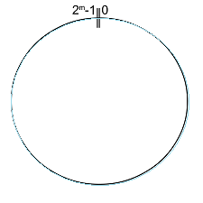
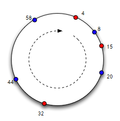
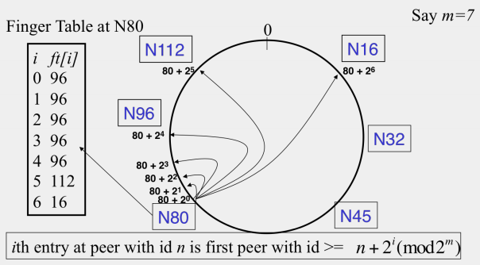

# 3.2 Chord 协议

[Chord](https://en.wikipedia.org/wiki/Chord_(peer-to-peer)) 诞生于2001年。第一代 DHT 协议都是在那年涌现的，另外几个是：[CAN](https://en.wikipedia.org/wiki/Content_addressable_network)、[Tapestry](https://en.wikipedia.org/wiki/Tapestry_(DHT))、[Pastry](https://en.wikipedia.org/wiki/Pastry_(DHT))。

Chord 是 MIT 的几个技术牛人一起搞出来的，这几个人中包括世界级的黑客：罗伯特·莫里斯（[Robert Morris](https://en.wikipedia.org/wiki/Robert_Tappan_Morris)）。
此人以**[莫里斯蠕虫](https://zh.wikipedia.org/wiki/%E8%8E%AB%E9%87%8C%E6%96%AF%E8%A0%95%E8%99%AB)**而享誉信息安全界。这是 IT 史上第一个蠕虫（注：蠕虫可以利用网络实时传播），这个蠕虫对当时（1988年）的互联网造成毁灭性打击（一天之内，约十分之一的互联网主机中招并下线）。

他不仅是编程高手兼顶级黑客，而且是创业者兼投资人。他与同样大名鼎鼎的保罗·格雷汉姆（[Paul Graham](https://en.wikipedia.org/wiki/Paul_Graham_(computer_programmer))）以及 [Trevor Blackwell](https://en.wikipedia.org/wiki/Trevor_Blackwell)，3人在1995年共同创立 Viaweb，并在1998年把公司以5千万美元卖给 Yahoo。然后他们拿这笔钱创办了 [Y Combinator](https://en.wikipedia.org/wiki/Y_Combinator_(company))（如今世界闻名的风投机构）,然后 Y Combinator 又投资了 [Protocol Labs](https://protocol.ai/) 包括其中的 IPFS 这也算是有历史渊源了。

## 3.2.1 一致性哈希（Consistent Hashing）

Chord 的拓扑结构采用的是[一致性哈希](https://en.wikipedia.org/wiki/Consistent_hashing)的设计。

Chord 主要是为了解决**节点动态变化**的难点。为了解决这个难点，一致性哈希把哈希值空间（keyspace）构成一个环。对于`m`比特的散列值，其范围是 `[0, 2^m-1]`。你把这个区间头尾相接就变成一个环，其周长是 `2^m`。然后对这个环规定了一个移动方向（比如顺时针）。

如果 `node ID` 和 `data key` 是同构的，那么这两者都可以映射到这个环上（对应于环上的某点）。

环形的 keyspace

假设有某个**节点A**，距离它最近的是**节点B**（以顺时针方向衡量距离）。那么称 B 是 A 的继任（successor），A 是 B 的前任（predecessor）。

数据隶属于距离最小的节点。以 m = 6 的环形空间为例：

+ 数据区间 [5,8] 隶属于节点8
+ 数据区间 [9,15] 隶属于节点15
+ ......
+ 数据区间 [59,4] 隶属于节点4（注：6 比特的环形空间，63之后是0）

以上就是一致性哈希的拓扑结构，同时也是 Chord 的拓扑结构。

## 3.2.2 路由机制

### 基本路由（简单遍历）

当收到请求（`key`），先看`key`是否在自己这里。如果在自己这里，就直接返回信息；否则就把`key`转发给自己的继任者。以此类推。

这种方式时间复杂度是：`O(N)`。对于一个节点数很多的 DHT 网络，这种做法显然非常低效。

### 高级路由（Finger Table）

由于基本路由非常低效，自然就引入更高级的玩法——基于`Finger Table`的路由。

`Finger Table`是一个列表，最多包含 `m` 项（`m` 就是散列值的比特数），每一项都是节点 ID。

假设当前节点的 ID 是`n`，那么表中第`i`项的值是：`successor( (n + 2i) mod 2m )`

当收到请求（key），就到`Finger Table`中找到最大的且不超过`key`的那一项，然后把`key`转发给这一项对应的节点。

有了`Finger Table`之后，时间复杂度可以优化为：`O(log N)`。

### 节点的加入

1. 任何一个新来的节点（假设叫 A），需要先跟 DHT 中已有的任一节点（假设叫 B）建立连接。
2. A 随机生成一个散列值作为自己的 ID（对于足够大的散列值空间，ID 相同的概率忽略不计）
3. A 通过跟 B 进行查询，找到自己这个 ID 在环上的接头人。也就是——找到自己这个 ID 对应的**继任**（假设叫 C）与**前任**（假设叫 D）
4. 接下来，A 需要跟 C 和 D 进行一系列互动，使得自己成为 C 的前任，以及 D 的继任。
　　这个互动过程，大致类似于在双向链表当中插入元素。

### 节点的正常退出

如果某个节点想要主动离开这个 DHT 网络，按照约定需要作一些善后的处理工作。比如说，通知自己的前任去更新其继任者......这些善后处理，大致类似于：在双向链表中删除元素。

### 节点的【异常】退出

作为一个分布式系统，任何节点都有可能意外下线（也就是说，来不及进行善后就挂掉了）

假设节点A的继任者**异常**下线了，那么节点 A 该如何处理？

Chord 引入了一个**继任者候选列表**的概念。每个节点都用这个列表来包含：距离自己最近的 `N` 个节点的信息，顺序是**由近到远**。一旦自己的继任者下线了，就在列表中找到一个**距离最近且在线**的节点，作为新的继任者。然后节点 A 更新该列表，确保依然有 `N`个候选。更新完**继任者候选列表**后，节点 A 也会通知自己的前任，那么 A 的前任也就能更新自己的**继任者候选列表**。

## 参考阅读

如果大家要详细了解Chord，建议阅读论文[<<Chord——A Scalable Peer-to-peer Lookup Service for Internet Applications>>](https://docs.google.com/document/d/18z3kYelg0ZR5zcquRs_CAZiGee2affHNQ2Cdt7gjqMs/)

## 链接

- [目录](SUMMARY.md)
- 上一节：[分布式哈希表（DHT）](03.1.md)
- 下一节：[Kademlia 协议](03.3.md)
