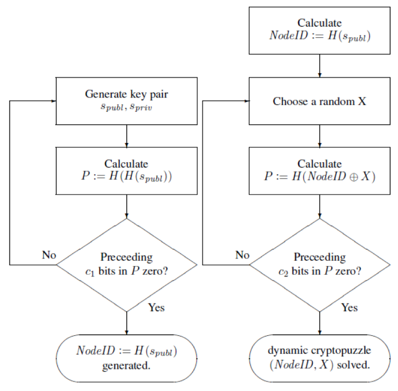

# 3.4 S/Kademlia 协议

P2P 系统最主要的问题就是安全性问题，目前已经有很多针对 P2P 网络的攻击，虽然理论上给出了很多解决此类攻击的处理方式，但是真正用在项目中的几乎没有。S/Kademlia 是一种基于安全 Key 的路由协议，该协议通过在多条不相交的路径上使用并行查找来抵抗常见的攻击，并用加密技术来限制节点 ID 生成，然后引入可靠的兄弟广播来解决这个问题。[点击下载论文](http://citeseerx.ist.psu.edu/viewdoc/download?doi=10.1.1.68.4986&rep=rep1&type=pdf)

## 3.4.1 针对 Kademlia 网络的攻击

### 日蚀攻击( Eclipse attack )

这种攻击的方式是尝试在网络中放置敌对节点，从而将一个或多个节点与其隔离，即所有消息都通过至少一个敌对节点进行路由。 这使攻击者可以控制覆盖网络的一部分。 因此，日蚀攻击可以从覆盖网络**隐藏**一些节点。 首先，如果一个节点不能自由选择其节点ID，其次，当它很难影响其他节点的路由表时，可以避免这种情况。 由于 Kademlia 采用 K-桶 中的活跃节点，并且只添加节点，如果一个桶未满，只要网络启动，这种攻击就很容易实现。

### 女巫攻击（Sybil attack）

如果一个节点在网络能够自由选择它的 ID，攻击者在网络中放一些恶意节点，使得信息都必须经由恶意节点传递。恶意节点就能够在网络将一个或几个节点从网络中隐藏掉。要解决日蚀攻击，只要恶意节点不能自由选择 ID 或者很难通过策略修改其他节点的 K-Bucket，这一节点就避免了。但 KAD 会优先请求 K-Bucket 中的长时间在线的节点，一旦被攻击节点的 K-Bucket 是非满的，恶意节点就有机会加入攻击节点的 K-Bucket，那么攻击者只要足够长时间在线就能实现攻击了。

### 客户流失攻击（Churn attack）

攻击者控制一堆节点，一下子把节点从网络中流失，从而导致网络稳定性降低。

### 敌对路由（Adversarial routing）

恶意节点收到查询指令后，不按照KAD的要求返回距离Key最接近的网络节点，而是转移给同伙节点，最终导致查询实效。为了避免这种无聊的敌对路由攻击，设计算法在查询时进行并行查询，每一条查询路径不想交，一旦并行查询的路径中有一条不碰到而已节点，就能成功查询了。

## 3.4.2 S/Kademlia 解决方式

S/Kademlia 协议针对 KAD 容易被攻击做出了几个改进：

1. 为了避免日蚀攻击和女巫攻击，S/Kademlia 需要节点不能自由选择节点 ID，不能大批量生成 ID，同时不能窃取和伪装其他节点的 ID。肯定就需要通过非对称加密确保节点身份不被窃取，设置一定的计算量障碍，强迫节点进行一定的哈希运算确保不能自由选择和批量生产。
2. 为避免敌对路由攻击，设计并发不想交的查询路径。

### 安全的节点分配策略

S/Kademlia 节点 ID 的分配策略有三个：

+ 不能自由选择
+ 不能大量生成
+ 不能窃取和伪装。

S/Kademlia 要求每个节点在接入网络前必须解决两个密码学问题。

+ 静态问题是：产生一对公钥和私钥，公钥两次哈希运算后，具有 C1 个前导零。公钥的一次哈希值就是节点的 NodeID。
+ 动态问题是：不断生成一个随机数 X，将 X 与 NodeID 求`XOR` 再求哈希，哈希值要求 C2 个前导零。

用于nodeId生成的静态（左）和动态（右）加密难题

这样设计，第一个静态问题，保证节点不能再自由选择节点 ID，后一个动态问题，提高了大量生成ID的成本。女巫攻击和日蚀攻击将难以进行。

为确保节点身份不被窃取，节点对发出的消息进行签名。其他节点收到消息，验证签名的合法性，然后检查ID是否满足两个难题的要求。验证节点信息的合法性的时间复杂度是很低的，而生成这样一个合法的攻击信息的时间复杂度是很高的，这种不对称就能避免上面三种攻击了。

### 不相交的路径查询算法

Kademlia 协议中，访问`α`个 K-Bucket 中的节点，然后排序后，选择前 α 个继续迭代请求，缺点很明显，如果有恶意节点，查询很可能就会失败。

S/Kademlia 提出每次查询选择 k 个节点，放入 d 个不同的桶中。这 d 个桶进行查找，d 条查询路径做到不相交，单个桶有失效的可能，但是只要 d 个桶中有一条查询到了需要的信息，工作就完成了。通过不相交路径查询，解决了敌对路由攻击。

## 总结

S/Kademlia 提出以上切实可行的解决方案，使得原有的 Kademlia 更具弹性。 首先，通过结合公钥密码术使用加密谜题来限制 nodeId 生成。 此外，我们通过兄弟列表扩展 Kademlia 路由表。 这降低了桶分裂算法的复杂性，并允许 DHT 以安全复制的方式存储数据。 最后，提出了一种查找算法，该算法使用多条不相交路径来提高查找成功率。

- [目录](SUMMARY.md)
- 上一节：[Kademlia 协议](03.3.md)
- 下一节：[BitTorrent 协议](03.5.md)
