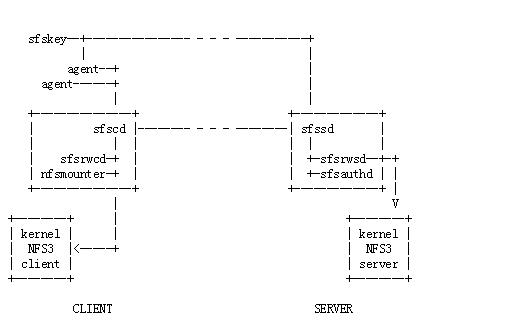

# 3.7 自验证文件系统(SFS)

自验证文件系统（SFS，Self-Certifying File System）是一种网络文件系统，可为不受信任的网络提供强大的安全性。与此同时 SFS 尽量避免安全性损害性能。用户可以从世界上任何客户端访问任何服务器，并与任何人共享文件。无需依赖系统管理员或受信任的第三方来协调跨管理领域的文件共享，在安全性不是优先考虑的情况下，SFS 提供方便的文件共享。

SFS 是在2000年6月由 DavidMazières 发表的论文第一次提出。论文 [Self-Certifying File System Implementation for Windows](https://pdos.csail.mit.edu/papers/sfs:euresti-meng.pdf)

## 3.7.1 SFS 设计目标

SFS是一个网络文件系统，可让您从任何地方访问文件，并与任何人共享。SFS的设计考虑了三个目标：

+ 安全
	+ SFS 假定恶意方完全控制网络。它确保对网络的控制只允许它们延迟文件系统的操作或隐藏服务器的存在，直到重新建立可靠的网络通信。
+ 全局命名空间
	+ SFS 将所有远程文件系统安装在该目录下/sfs。该目录的内容在世界上的每个客户端上都是相同的。客户端没有管理领域的概念，也没有特定于站点的配置选项。服务器授予用户访问权限，而不是客户端。因此，用户可以从他们信任的任何运行 SFS 客户端软件的计算机上访问他们的文件。
+ 分散控制
	+ SFS 不依赖任何特权授权来管理全局命名空间。在网络上上拥有计算机的任何人都可以设置 SFS 文件服务器，而无需获取任何类型的证书。世界上所有客户都可以立即访问到新服务器。

## 3.7.2 SFS 实现方式

SFS通过将密钥管理与文件系统安全性分离来实现。它通过等效的公钥来命名文件系统。每个远程文件服务器都安装在以下格式的目录下： 

`/sfs/@Location,HostID`
或者
`/sfs/@Location%port,HostID`

location 是 DNS 主机名或 IP 地址。 HostID 是文件服务器公钥加密哈希。 port 是可选的 TCP 端口号（默认值为4）。此命名方案允许 SFS 客户端仅在给定文件名的情况下对服务器进行身份验证，从而使客户端不再依赖外部密钥管理机制。SFS 调用其上安装文件服务器自我认证路径名的目录。

自我认证的路径名允许用户通过多种不同的技术对服务器进行身份验证。作为一个安全的全局文件系统，SFS本身提供了一个方便的密钥管理基础架构。通过使文件命名空间成为密钥认证命名空间。因此，用户可以仅使用标准文件实用程序来实现许多密钥管理方案。此外，自我认证的路径名允许人们使用另一个密钥管理机制来引导一个密钥管理机制，使得 SFS 比具有内置密钥管理的任何文件系统更加通用。

通过模块化实现，SFS 还将用户身份验证放在文件系统之外。不受信任的用户进程使用对文件系统，根据需要向远程文件服务器进行验证。

最后，SFS将密钥撤销与密钥分发分开。

## 3.7.3 SFS 架构

SFS 是典型的 CS 架构。
在客户端，SFS 通过伪装成 NFS 服务器并与本地操作系统的 NFS3 客户端通信来实现文件系统。该程序sfscd 由 root 运行（通常在启动时）。 sfscd 产生另外两个守护进程 nfsmounter 和 sfsrwcd。

nfsmounter 处理 NFS 文件系统的安装和卸载。如果发生 sfscd 故障，nfsmounter 接管成为 NFS 服务器，以防止文件系统操作在尝试卸载文件系统时阻塞。

sfsrwcd 实现普通的读写文件系统协议。随着 SFS 协议的其他实现变得可用，它们将被实现为并行运行的守护进程 sfsrwcd。

SFS 客户端计算机的每个用户都必须运行该 sfsagent 命令的实例 。 sfsagent 有几个目的。它在用户访问新文件系统时进行用户身份验证。它可以动态获取 HostID，这是一种称为动态服务器身份验证的机制。最后，它可以对用户访问的服务器的 HostID 执行撤销检查，以确保用户不访问与错误私钥对应的 HostID。

该 sfskey 实用程序管理用户和服务器密钥。它允许用户控制和配置其代理。用户可以使用 sfskey 代理持有的列表键和删除密钥将新私钥交给他们的代理。sfskey 将使用 SRP，SRP 从远程服务器获取密钥。它允许用户在远程服务器上更改其公钥。最后，sfskey 可以配置代理进行动态服务器身份验证和撤销检查。

在服务器端，程序 sfssd 产生两个守护进程，sfsrwsd 和 sfsauthd。如果虚拟主机或软件的多个版本正在运行，则 sfssd 可能会生成每个守护程序的多个实例。 sfssd 侦听端口4上的 TCP 连接。然后根据客户端请求的自我认证路径名和服务，将每个连接交给其中一个守护程序。

sfsrwsd 是服务器端的对应 sfsrwcd。sfsrwcd 使用 SFS 文件系统协议与客户端进程通信，并通过充当本地操作系统的 NFS 服务器的客户端来访问本地磁盘。 sfsrwsd 是 sfs中必须在运行它之前配置的一个程序（sfsrwsd_config）。

sfsauthd 处理用户认证。它直接与 sfsrwsd 文件系统的用户进行身份验证。它还接受通过网络连接，sfskey 以便用户下载其私钥或更改其公钥。

- [目录](SUMMARY.md)
- 上一节：[BitTorrent 协议](03.6.md)
- 下一章：[IPFS Multiformats](04.0.md)