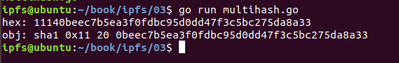
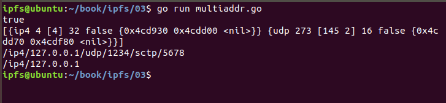
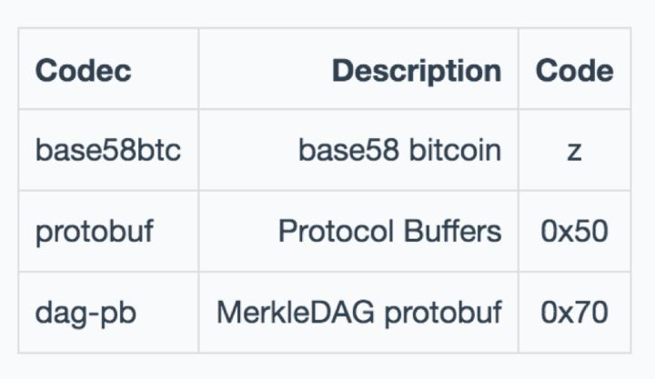
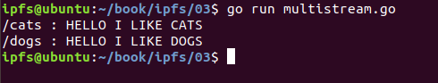

# 第4章 IPFS Multiformats

## 4.1 什么是 Multiformats

Multiformats 作为IPFS 协议体系中的重要组成部分，它的作用是在未来系统中负责身份的加密与数据的自我描述。

Multiformats 是一系列协议集合，通过自描述格式可以让系统互相协作和升级。

Multiformats 协议基于以下目的进行设计：

+ 它们必须是数据可以自我描述的。
+ 它们必须避免锁定并且具有可扩展性。
+ 它们必须紧凑并且能用二进制格式表示。
+ 它们必须具有人类可读的格式。

我们在设计系统中经常会去权衡采用什么样的数据格式、算法、编码等等。即使有大量的计划准备，现在的决策也可能会导致未来的变化，或许现在的决策不是最佳的解决方案，但是允许系统在未来演化和发展这是非常重要的。而 Multiformats 就是可以对数据进行自我描述改造，最终组成一个互操作和可升级的系统。Multiformats 就是一组协议的集合，通过增强自我描述的格式值来实现，它允许协议相互操作，可以保持协议灵活度、并可扩展、可升级，帮助我们避免被锁定在一个值上，打造一个永不过时的系统。

## 4.2 Multiformats 协议组成

Multiformats 由如下的子协议组成：

+ multihash - 自描述哈希
+ multiaddr - 自描述网络地址
+ multibase - 自描述基编码
+ multicodec - 自描述序列化
+ multistream - 自描述流网络协议
+ multigram (WIP) - 自描述分组网络协议

### 4.2.1 multihash 自描述哈希

在依赖加密安全散列函数的系统中，Multihash 非常的重要。在大型工具生态系统中我们可能已经对哈希值进行了假设，例如函数和摘要大小，将来升级会成为一个噩梦，因为所有相关的工具都必须升级以使用新的哈希函数和新的哈希摘要长度。这些工具可能面临严重的互操作性问题或容易出错。所以我们设计了 multihash 来解决这个问题。

#### multihash 格式

Multihash 采用 TLV（type-length-value）的格式进行描述：

`<hash-func-type><digest-length><digest-value>`

+ 类型（hash-function-type）：采用无符号的varints进行描述。并采用表进行配置。
+ 长度（digest-length）：采用无符号varints计算摘要的长度，以字节为单位。
+ 值（digest-value）：表示 Hash 函数的摘要，长度为 digest-length 字节

#### multihash 示例

Multihash ： `122041dd7b6443542e75701aa98a0c235951a28a0d851b11564d20022ab11d2589a8`

代表的含义为：

+ 哈希函数：`sha2-256 (0x12)`
+ 长度：`32 (0x20)`
+ 摘要：`41dd7b6443542e75701aa98a0c235951a28a0d851b11564d20022ab11d2589a8`

### 4.2.2 如何使用 multihash

Multihash 有多种语言实现：

+ go-multihash
+ java-multihash
+ js-multihash
+ python-multihash

我们采用 Golang 来使用 multihash。

**安装 multihash**

`go get github.com/multiformats/go-multihash`

代码：

	package main
	
	import (
	    "encoding/hex"
	    "fmt"
	
	    "github.com/multiformats/go-multihash"
	)
	
	func main() {
	    // 将字符串转换为字节数组
	    buf, _ := hex.DecodeString("0beec7b5ea3f0fdbc95d0dd47f3c5bc275da8a33")
	    // 将字节数组用 multihash 编码
	    mHashBuf, _ := multihash.EncodeName(buf, "sha1")
	    // 打印编码之后的摘要
	    fmt.Printf("hex: %s\n", hex.EncodeToString(mHashBuf))
	    // 将 binary multihash 转换为 DecodedMultihash 的形式
	    mHash, _ := multihash.Decode(mHashBuf)
	    // 获取数字摘要
	    sha1hex := hex.EncodeToString(mHash.Digest)
	    // 打印
	    fmt.Printf("obj: %v 0x%x %d %s\n", mHash.Name, mHash.Code, mHash.Length, sha1hex)
	}

运行结果：

## 4.2.3 multihash 源码分析

代码路径: `src\github.com\multiformats\go-multihash\multihash.go`

Multihash 目前支持的哈希类型：

	// Names maps the name of a hash to the code
	var Names = map[string]uint64{
	    "id":           ID,
	    "sha1":         SHA1,
	    "sha2-256":     SHA2_256,
	    "sha2-512":     SHA2_512,
	    "sha3":         SHA3_512,
	    "sha3-224":     SHA3_224,
	    "sha3-256":     SHA3_256,
	    "sha3-384":     SHA3_384,
	    "sha3-512":     SHA3_512,
	    "dbl-sha2-256": DBL_SHA2_256,
	    "murmur3":      MURMUR3,
	    "keccak-224":   KECCAK_224,
	    "keccak-256":   KECCAK_256,
	    "keccak-384":   KECCAK_384,
	    "keccak-512":   KECCAK_512,
	    "shake-128":    SHAKE_128,
	    "shake-256":    SHAKE_256,
	}

对应的值为：

	// DefaultLengths maps a hash code to it's default length
	var DefaultLengths = map[uint64]int{
	    ID:           -1,
	    SHA1:         20,
	    SHA2_256:     32,
	    SHA2_512:     64,
	    SHA3_224:     28,
	    SHA3_256:     32,
	    SHA3_384:     48,
	    SHA3_512:     64,
	    DBL_SHA2_256: 32,
	    KECCAK_224:   28,
	    KECCAK_256:   32,
	    MURMUR3:      4,
	    KECCAK_384:   48,
	    KECCAK_512:   64,
	    SHAKE_128:    32,
	    SHAKE_256:    64,
	}

我们将 Multihash 二进制流转换为 DecodedMultiHash，这样就很方便的访问 Multihash 的属性。
	
	// DecodedMultihash represents a parsed multihash and allows
	// easy access to the different parts of a multihash.
	type DecodedMultihash struct {
	    Code   uint64
	    Name   string
	    Length int    // Length is just int as it is type of len() opearator
	    Digest []byte // Digest holds the raw multihash bytes
	}

**Multihash 中两个比较重要的函数**

	// Decode parses multihash bytes into a DecodedMultihash.
	func Decode(buf []byte) (*DecodedMultihash, error) 
	
	// Encode a hash digest along with the specified function code.
	// Note: the length is derived from the length of the digest itself.
	func Encode(buf []byte, code uint64) ([]byte, error) 

## 4.3 multiaddr 自描述网络地址

Multiaddr 旨在使网络成为未来的证明，可以组合和高效。

目前的寻址方案有许多问题：

+ 它们阻碍协议之间的协议迁移和互操作性。
+ 它们没有很好的构造，但是很少有 X-over-Y 构造，但只能在经典 uri/url 或者 host:port 方案中解决。
+ 它们不支持多路复用的：它们是地址端口，而不是进程。
+ 它们是隐式的，因为它们假设 out-of-band 值和上下文。
+ 它们没有高效的机器可读表示。

Multiaddr 通过将网络地址建模为任意的协议封装来解决这些问题：

+ 任何网络协议的Multiaddrs支持地址。
+ Multiaddrs 是自描述的。
+ Multiaddrs 符合简单语法，这使得解析和构造它们变得简单。
+ Multiaddrs 具有人类可读和高效的机器可读表示。
+ Multiaddrs 封装良好，允许对封装层进行简单的封装和展开。

例如：

	127.0.0.1:9090   # ip4. is this TCP? or UDP? or something else?
	[::1]:3217       # ip6. is this TCP? or UDP? or something else?
	
	http://127.0.0.1/baz.jpg
	http://foo.com/bar/baz.jpg
	//foo.com:1234
	 # use DNS, to resolve to either ip4 or ip6, but definitely use
	 # tcp after. or maybe quic... >.<
	 # these default to TCP port :80.

采用 multiaddr 的方式描述为：

	/ip4/127.0.0.1/udp/9090/quic
	/ip6/::1/tcp/3217
	/ip4/127.0.0.1/tcp/80/http/baz.jpg
	/dns4/foo.com/tcp/80/http/bar/baz.jpg
	/dns6/foo.com/tcp/443/https

通过对比，显然采用  multiaddr 的解决方案更加的优雅，它提供了一致性的处理这些网络结构。

### 4.3.1 multiaddr 格式

Multiaddr 采用 递归TLV（type+length+value）的格式进行编码，它有两种形式：

+ 人类友好版本（采用UTF-8编码）。
+ 机器友好版本，用于存储，传输。

人类友好格式定义如下:

`(/<addr-protocol-str-code>/<addr-value>)+`

+ 路径符号嵌套协议和地址，例如：/ip4/127.0.0.1/udp/4023/quic 
+ 类型（addr-protocol-str-code）是标识网络协议的字符串代码。 协议表是可配置的。
+ 值是网络地址值，采用字符串形式。

机器友好的格式定义如下：

`(<addr-protocol-code><addr-value>)+`

+ 类型（addr-protocol-code）是标识网络协议的变量整数。 协议表是可配置的。
+ 长度 是一个无符号变量整数，用于计算地址值的长度（以字节为单位）
+ 值（addr-value） 是网络地址长度值

### multiaddr 示例

**安装 multiaddr**

`go get github.com/multiformats/go-multiaddr`

示例代码：

	package main
	
	import (
	    "fmt"
	
	    ma "github.com/multiformats/go-multiaddr"
	)
	
	func main() {
	    // construct from a string (err signals parse failure)
	    m1, err := ma.NewMultiaddr("/ip4/127.0.0.1/udp/1234")
	    if err != nil {
	        panic(err)
	    }
	    // construct from bytes (err signals parse failure)
	    m2, err := ma.NewMultiaddrBytes(m1.Bytes())
	    if err != nil {
	        panic(err)
	    }
	
	    // true
	    fmt.Println(m2.Equal(m1))
	    fmt.Println(m1.Protocols())
	    m3, err := ma.NewMultiaddr("/sctp/5678")
	    if err != nil {
	        panic(err)
	    }
	    fmt.Println(m1.Encapsulate(m3))
	    m4, err := ma.NewMultiaddr("/udp/1234")
	    if err != nil {
	        panic(err)
	    }
	    fmt.Println(m1.Decapsulate(m4))
	}

输出结果：

### 4.3.2 multiaddr 源码分析

源码地址: `src\github.com\multiformats\go-multiaddr\multiaddr.go`

**NewMultiaddr 将给定的字符串转换为multiaddr 格式**

`func NewMultiaddr(s string) (a Multiaddr, err error) `

**rotocols 返回multiaddr中的网络协议**

	// Protocols returns the list of protocols this Multiaddr has.
	// will panic in case we access bytes incorrectly.
	func (m *multiaddr) Protocols() []Protocol

**追加网络协议**

	// Encapsulate wraps a given Multiaddr, returning the resulting joined Multiaddr
	func (m *multiaddr) Encapsulate(o Multiaddr) Multiaddr

**去掉网络协议**
	
	// Decapsulate unwraps Multiaddr up until the given Multiaddr is found.
	func (m *multiaddr) Decapsulate(o Multiaddr) Multiaddr 

## 4.4 multibase自描述基编码

multibase 代表的是一种编码格式， 方便把数据编码成不同的格式， 比如这里定义了2进制、8进制、10进制、16进制、也有我们熟悉的 base58btc 和 base64 编码。

支持的编码格式如下：

	Multibase Table v1.0.0-RC (semver)

	encoding      codes   name
	identity      0x00    8-bit binary (encoder and decoder keeps data unmodified)
	base1         1       unary tends to be 11111
	base2         0       binary has 1 and 0
	base8         7       highest char in octal
	base10        9       highest char in decimal
	base16        F, f    highest char in hex
	base32        B, b    rfc4648 - no padding - highest letter
	base32pad     C, c    rfc4648 - with padding
	base32hex     V, v    rfc4648 - no padding - highest char
	base32hexpad  T, t    rfc4648 - with padding
	base32z       h       z-base-32 - used by Tahoe-LAFS - highest letter
	base58flickr  Z       highest char
	base58btc     z       highest char
	base64        m       rfc4648 - no padding
	base64pad     M       rfc4648 - with padding - MIME encoding
	base64url     u       rfc4648 - no padding
	base64urlpad  U       rfc4648 - with padding

### 4.4.1 multibase 格式

`<varint-base-encoding-code><base-encoded-data>`

+ varint-base-encoding-code 从上面查表得到
+ base-encoded-data  数据

示例:
	
	4D756C74696261736520697320617765736F6D6521205C6F2F # base16 (hex)
	JV2WY5DJMJQXGZJANFZSAYLXMVZW63LFEEQFY3ZP           # base32
	YAjKoNbau5KiqmHPmSxYCvn66dA1vLmwbt                 # base58
	TXVsdGliYXNlIGlzIGF3ZXNvbWUhIFxvLw==               # base64
	F4D756C74696261736520697320617765736F6D6521205C6F2F # base16 F
	BJV2WY5DJMJQXGZJANFZSAYLXMVZW63LFEEQFY3ZP           # base32 B
	zYAjKoNbau5KiqmHPmSxYCvn66dA1vLmwbt                 # base58 z
	MTXVsdGliYXNlIGlzIGF3ZXNvbWUhIFxvLw==               # base64 M

### 4.4.2 multibase 源码分析

源码路径：`src\github.com\multiformats\go-multibase\multibase.go`

**默认编码表**

	// specified in standard are left out
	var Encodings = map[string]Encoding{
	    "identity":          0x00,
	    "base16":            'f',
	    "base16upper":       'F',
	    "base32":            'b',
	    "base32upper":       'B',
	    "base32pad":         'c',
	    "base32padupper":    'C',
	    "base32hex":         'v',
	    "base32hexupper":    'V',
	    "base32hexpad":      't',
	    "base32hexpadupper": 'T',
	    "base58flickr":      'Z',
	    "base58btc":         'z',
	    "base64":            'm',
	    "base64url":         'u',
	    "base64pad":         'M',
	    "base64urlpad":      'U',
	}

编码：

	// Encode encodes a given byte slice with the selected encoding and returns a
	// multibase string (<encoding><base-encoded-string>). It will return
	// an error if the selected base is not known.
	func Encode(base Encoding, data []byte) (string, error) 

解码：

	// Decode takes a multibase string and decodes into a bytes buffer.
	// It will return an error if the selected base is not known.
	func Decode(data string) (Encoding, []byte, error) 

## 4.5 multicodec 自描述序列化

multicodec 代表的是自描述的编解码， 其实是个 table， 用1到2个字节定了数据内容的格式， 比如用字母 z 表示 base58 btc编码， 0x50 表示 protobuf 等等。

Table 定义在如下位置 https://github.com/multiformats/multicodec/blob/master/table.csv

### multicodec 格式

`<multicodec><encoded-data>`

我们可以简写成

`<mc><data>`

## 4.6 multistream 自描述流网络协议

multistream 利用 multicodec，实现了自描述的功能， 下面是基于一个 javascript 的例子； 先  new 一个buffer 对象， 里面是 json 对象， 然后给它加一个前缀 protobuf, 这样这个multistream 就构造好了， 可以通过网络传输。在解析时可以先取 codec 前缀，然后移除前缀， 得到具体的数据内容。

	// encode some json
	const buf = new Buffer(JSON.stringify({ hello: 'world' }))
	
	const prefixedBuf = multistream.addPrefix('json', str) // prepends multicodec ('json')
	console.log(prefixedBuf)
	// <Buffer 06 2f 6a 73 6f 6e 2f 7b 22 68 65 6c 6c 6f 22 3a 22 77 6f 72 6c 64 22 7d>
	
	const.log(prefixedBuf.toString('hex'))
	// 062f6a736f6e2f7b2268656c6c6f223a22776f726c64227d
	
	// let's get the Codec and then get the data back
	
	const codec = multicodec.getCodec(prefixedBuf)
	console.log(codec)
	// json
	
	console.log(multistream.rmPrefix(prefixedBuf).toString())
	// "{ \"hello\": \"world\" }

输出结果：

	hex:   062f6a736f6e2f7b2268656c6c6f223a22776f726c64227d
	ascii: /json\n"{\"hello\":\"world\"}"

### 4.6. 1 multistream 源码分析

源码路径：`src\github.com\multiformats\go-multistream\multistream.go`

**安装 go-multistream**

`go get github.com/multiformats/go-multistream`

我们通过多路复用器让用户添加不同的处理程序来处理不同的“协议”:
 

	package main
	
	import (
	    "fmt"
	    "io"
	    "io/ioutil"
	    "net"
	
	    ms "github.com/multiformats/go-multistream"
	)
	
	// 创建多路复用器, 针对不用的协议创建不同的处理函数
	// 创建 "/cats" and "/docs" 两种不同的协议
	func main() {
	    mux := ms.NewMultistreamMuxer()
	    mux.AddHandler("/cats", func(proto string, rwc io.ReadWriteCloser) error {
	        fmt.Fprintln(rwc, proto, ": HELLO I LIKE CATS")
	        return rwc.Close()
	    })
	    mux.AddHandler("/dogs", func(proto string, rwc io.ReadWriteCloser) error {
	        fmt.Fprintln(rwc, proto, ": HELLO I LIKE DOGS")
	        return rwc.Close()
	    })
	
	    list, err := net.Listen("tcp", ":8765")
	    if err != nil {
	        panic(err)
	    }
	
	    go func() {
	        for {
	            con, err := list.Accept()
	            if err != nil {
	                panic(err)
	            }
	
	            go mux.Handle(con)
	        }
	    }()
	
	    // 开始测试
	    conn, err := net.Dial("tcp", ":8765")
	    if err != nil {
	        panic(err)
	    }
	
	    // /cats 协议
	    mstream := ms.NewMSSelect(conn, "/cats")
	    cats, err := ioutil.ReadAll(mstream)
	    if err != nil {
	        panic(err)
	    }
	    fmt.Printf("%s", cats)
	    mstream.Close()
	
	    conn, err = net.Dial("tcp", ":8765")
	    if err != nil {
	        panic(err)
	    }
	    defer conn.Close()
	    // /dogs 协议
	    err = ms.SelectProtoOrFail("/dogs", conn)
	    if err != nil {
	        panic(err)
	    }
	    dogs, err := ioutil.ReadAll(conn)
	    if err != nil {
	        panic(err)
	    }
	    fmt.Printf("%s", dogs)
	    conn.Close()
	}

## 4.7 multigram (WIP) 自描述分组网络协议

用来处理协议协商和数据报文复用，目前还在开发中。地址位于 https://github.com/multiformats/multigram

####

- [目录](SUMMARY.md)
- 上一节：[自验证文件系统((SFS)](03.7.md)
- 下一节：[IPFS IPLD](05.0.md)