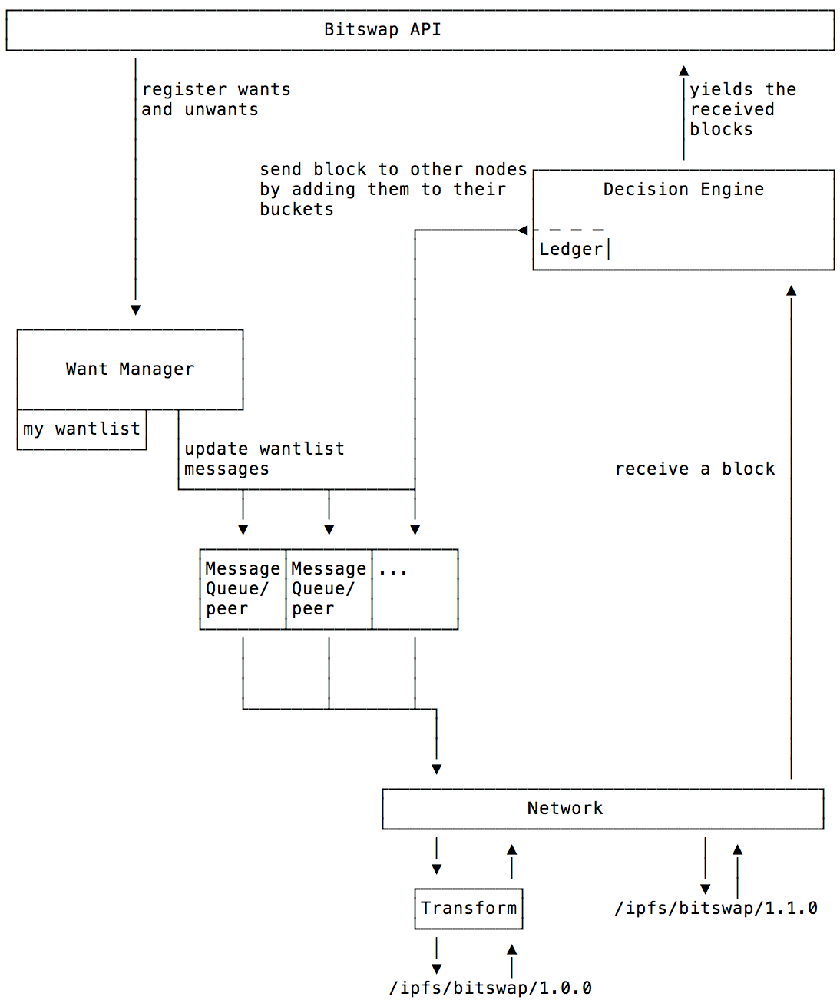
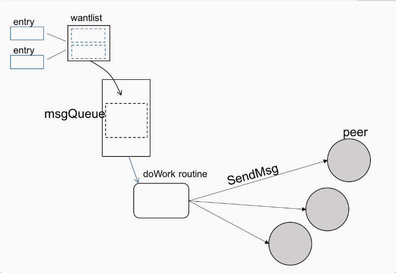

# IPFS Bitswap 详解

## 什么是 Bitswap

Bitswap 属于 IPFS 中的数据交换层。 它的作用是向网络中的其他节点请求 block 和发送 block。 Bitswap 有两个主要工作：

+ 试图从网络中获取客户端请求的块。
+ 将其拥有的 block 发送给其他节点。

Bitswap 是 IPFS 中的块交换协议。 它处理 IPFS 节点从网络获取 block 的请求。 它与其他 IPFS 节点交互，根据需要交换（获取+提供服务）block。
 
Bitswap 是一种基于消息的协议，与响应-回复模式不同的是，所有消息都包含想要的列表或 block。 收到需求列表后，IPFS 节点应该考虑发送想要的 block（如果有的话）。 收到块后，节点应发出一个“取消”的通知，表示他们不再需要该 block。 在协议级别，Bitswap 设计得非常简洁。

## Bitswap 流程图

Bitswap 主要有两个流程：向节点请求 block 和向节点提供block。 阻止请求主要由需求管理器负责，当需要新块时，它会告诉其他节点。 提供 block 服务主要由决策引擎处理，决策引擎决定如何在我们的节点之间分配资源。

详细流程如图所示：

+ CID: block 标识符.
+ Peer: 节点.
+ Block: 块.
+ Message: Bitswap 消息.
+ Entry: 条目
    + CID block 标识符.
    + Priority 优先级
    + Cancel 表示此条目是否从我们的需求列表中删除
+ Ledger: 账本，两个节点之间交换数据的记录。 每个节点为其他节点存储一个Ledger。

### Bitswap 消息组成

Bitswap 消息主要由两部分组成

+ wantlist
+ datablocks

Bitswap 消息格式如下：

	message Message {
	  message Wantlist {
	    message Entry {
	      optional string block = 1; // the block key
	      optional int32 priority = 2; // the priority (normalized). default to 1
	      optional bool cancel = 3;  // whether this revokes an entry
	    }
	
	    repeated Entry entries = 1; // a list of wantlist entries
	    optional bool full = 2;     // whether this is the full wantlist. default to false
	  }
	
	  optional Wantlist wantlist = 1;
	  repeated bytes blocks = 2;
}

### want-manager

want-manager 用来处理获取 block 的请求。 对于由用 cid 标识的   block，调用 Bitswap.GetBlock(cid)方法。 Bitswap.GetBlock(cid) 从网络请求 cid，如果收到相应的 Block，则返回它。换句话说 Bitswap.GetBlock(cid) 将 cid 添加到我们的需求列表中。 然后，want-manager 通过向每个节点的消息队列添加一个新条目来更新所有节点。

### Decision Engine

决策引擎决定如何将资源分配给节点。 当收到来节点的包含所需列表的消息时，将消息发送到决策引擎。 对于我们拥有的 wantlist 中的每个 block CID，该 block 都有一个 Task 添加到节点的 TaskQueue中。 一旦相应的 block 已被发送到该节点的消息队列，则认为任务已完成。

决策引擎中的主要数据结构采用 peer request queue (PRQ)。 PRQ将节点添加到加权循环队列，其中权重基于一个或多个 peer-specific 来度量。 目前，策略是一个函数，其输入是节点的 Ledger，输出是该节点的权重。 然后，节点在各自的TaskQueues 中提供任务。 在给定的循环轮次中服务每个节点的数据量由它们在队列中的相对权重确定。 计划在不久的将来进一步改进 Bitswap 策略指标和配置界面。

### 消息队列

每个活动节点都具有关联的消息队列。 消息队列保存要发送给该对等方的下一条消息。 消息队列从另外两个子系统接收更新：

+ Wantlist manager：当我们的需求列表中添加或删除CID时，我们必须更新相关节点 - 这些需求列表更新将发送到所有相关节点的消息队列。
+ 决策引擎：当我们有一个节点想要某一个块并且决策引擎决定发送该块时，我们将该块传播到该节点的消息队列。

task worker 查看消息队列，将等待消息出列，然后将其发送给收件人。

### Sessions

Bitswap 会话将会尝试优化发送到其他 Bitswap 客户端的 block 请求。

Sender:

+ open a bitswap stream
+ send one or more bitswap messages
+ close bistwap stream
  
Listener:

+ accept a bitswap stream
+ receive one or more bitswap messages
+ close bitswap stream

Events:

+ bitswap.addedBlock(block)
  + see if any peers want this block, and send it
+ bitswap.getBlock(key, cb)
  + add to wantlist
  + maybe send wantlist updates to peers
+ bitswap.cancelGet(key)
  + so that can send wantlist cancels
+ bitswap.receivedMessage(msg)
  + process the wantlist changes
  + process the blocks
+ bitswap.peerConnected(peer)
  + add peer to peer set + send them wantlist (maybe)
+ bitswap.peerDisconnected(peer)
  + remove peer from peer set

## 代码实现

### Session 

在 bitswap 上层的包装类，统一处理与其他节点交互的事件。

	// 新建一个Session ，然后启动协程处理事件
	func (bs *Bitswap) NewSession(ctx context.Context) *Session {
		s := &Session{
			activePeers:   make(map[peer.ID]struct{}), //活动节点
			liveWants:     make(map[string]time.Time), 
			newReqs:       make(chan []*cid.Cid),  //新请求
			cancelKeys:    make(chan []*cid.Cid),
			tofetch:       newCidQueue(), // cid 队列
			interestReqs:  make(chan interestReq), 
			ctx:           ctx,
			bs:            bs, // Bitswap
			incoming:      make(chan blkRecv),
			notif:         notifications.New(), //通知
			uuid:          loggables.Uuid("GetBlockRequest"),
			baseTickDelay: time.Millisecond * 500,
			id:            bs.getNextSessionID(),
		}
	  ...
		go s.run(ctx)
	  ...
		return s
	}
	
	//处理事件
	func (s *Session) run(ctx context.Context) {
		s.tick = time.NewTimer(provSearchDelay) //定时任务
		newpeers := make(chan peer.ID, 16)
		for {
			select {
			case blk := <-s.incoming: //如果获取到 block
				s.tick.Stop()
				if blk.from != "" {
					s.addActivePeer(blk.from) //将该节点加入活动节点
				}
				s.receiveBlock(ctx, blk.blk) //接受该 block
				s.resetTick()
			case keys := <-s.newReqs://新的需求
				for _, k := range keys {
					s.interest.Add(k.KeyString(), nil)
				}
				if len(s.liveWants) < activeWantsLimit {
					toadd := activeWantsLimit - len(s.liveWants)
					if toadd > len(keys) {
						toadd = len(keys)
					}
					now := keys[:toadd]
					keys = keys[toadd:]
					s.wantBlocks(ctx, now) //加入到需求 block 列表
				}
				for _, k := range keys {
					s.tofetch.Push(k)
				}
			case keys := <-s.cancelKeys:
				s.cancel(keys)
	
			case <-s.tick.C: //处理定时任务
				live := make([]*cid.Cid, 0, len(s.liveWants))
				now := time.Now()
				for c := range s.liveWants {
					cs, _ := cid.Cast([]byte(c))
					live = append(live, cs)
					s.liveWants[c] = now
				}
				// Broadcast these keys to everyone we're connected to
				s.bs.wm.WantBlocks(ctx, live, nil, s.id)
				if len(live) > 0 {
					go func(k *cid.Cid) {
						// TODO: have a task queue setup for this to:
						// - rate limit
						// - manage timeouts
						// - ensure two 'findprovs' calls for the same block don't run concurrently
						// - share peers between sessions based on interest set
						for p := range s.bs.network.FindProvidersAsync(ctx, k, 10) {
							newpeers <- p
						}
					}(live[0])
				}
				s.resetTick()
			case p := <-newpeers:
				s.addActivePeer(p)
			case lwchk := <-s.interestReqs:
				lwchk.resp <- s.cidIsWanted(lwchk.c)
			case <-ctx.Done():
				s.tick.Stop()
				s.bs.removeSession(s)
	
				cmgr := s.bs.network.ConnectionManager()
				for _, p := range s.activePeersArr {
					cmgr.UntagPeer(p, s.tag)
				}
				return
			}
		}
	}

### bitswap

	//初始化 bitswap 实例， 通过该实例访问 bitswap 网络。
	func New(parent context.Context, network bsnet.BitSwapNetwork,
		bstore blockstore.Blockstore) exchange.Interface {
	  ... 
		bs := &Bitswap{
			blockstore:    bstore,
			notifications: notif,
			engine:        decision.NewEngine(ctx, bstore), // 决策引擎
			network:       network,//网络
			findKeys:      make(chan *blockRequest, sizeBatchRequestChan),
			process:       px,
			newBlocks:     make(chan *cid.Cid, HasBlockBufferSize),
			provideKeys:   make(chan *cid.Cid, provideKeysBufferSize),
			wm:            NewWantManager(ctx, network), // want manager
			counters:      new(counters),
	
			dupMetric: dupHist,
			allMetric: allHist,
		}
	  //启动 want manager
		go bs.wm.Run()
		network.SetDelegate(bs)
	
		//启动异步工作线程
		bs.startWorkers(px, ctx)
	
		return bs
	}

### decision engine

	func NewEngine(ctx context.Context, bs bstore.Blockstore) *Engine {
		e := &Engine{
			ledgerMap:        make(map[peer.ID]*ledger),
			bs:               bs,
			peerRequestQueue: newPRQ(),
			outbox:           make(chan (<-chan *Envelope), outboxChanBuffer),
			workSignal:       make(chan struct{}, 1),
			ticker:           time.NewTicker(time.Millisecond * 100),
		}
		go e.taskWorker(ctx)
		return e
	}

### WantManager

	//调用 network 对 block 进行处理
	func NewWantManager(ctx context.Context, network bsnet.BitSwapNetwork) *WantManager {
		ctx, cancel := context.WithCancel(ctx)
		wantlistGauge := metrics.NewCtx(ctx, "wantlist_total",
			"Number of items in wantlist.").Gauge()
		sentHistogram := metrics.NewCtx(ctx, "sent_all_blocks_bytes", "Histogram of blocks sent by"+
			" this bitswap").Histogram(metricsBuckets)
		return &WantManager{
			incoming:      make(chan *wantSet, 10),
			connectEvent:  make(chan peerStatus, 10),
			peerReqs:      make(chan chan []peer.ID),
			peers:         make(map[peer.ID]*msgQueue),
			wl:            wantlist.NewThreadSafe(),
			bcwl:          wantlist.NewThreadSafe(),
			network:       network,
			ctx:           ctx,
			cancel:        cancel,
			wantlistGauge: wantlistGauge,
			sentHistogram: sentHistogram,
		}
	}

### network

	var (
		ProtocolBitswapOne    protocol.ID = "/ipfs/bitswap/1.0.0"
		ProtocolBitswapNoVers protocol.ID = "/ipfs/bitswap"
		ProtocolBitswap protocol.ID = "/ipfs/bitswap/1.1.0"
	)
	
	//根据不同的协议，调用网络进行相应的处理。
	
	func NewFromIpfsHost(host host.Host, r routing.ContentRouting) BitSwapNetwork {
		bitswapNetwork := impl{
			host:    host,
			routing: r,
		}
		host.SetStreamHandler(ProtocolBitswap, bitswapNetwork.handleNewStream)
		host.SetStreamHandler(ProtocolBitswapOne, bitswapNetwork.handleNewStream)
		host.SetStreamHandler(ProtocolBitswapNoVers, bitswapNetwork.handleNewStream)
		host.Network().Notify((*netNotifiee)(&bitswapNetwork))
		return &bitswapNetwork
	}

####

- [目录](SUMMARY.md)
- 上一章：[IPFS 存储层](06.0.md)
- 下一章：[IPFS 网络层](08.0.md)