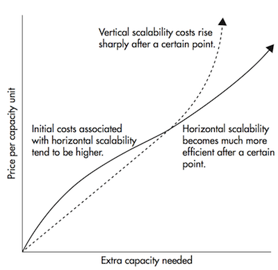
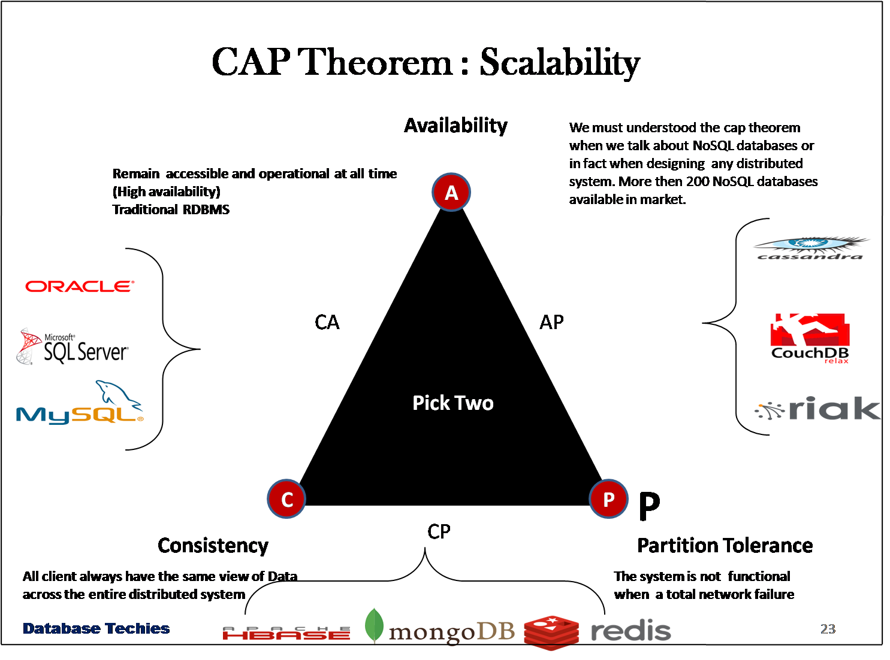
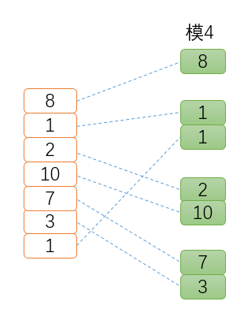
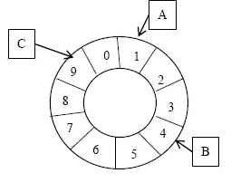
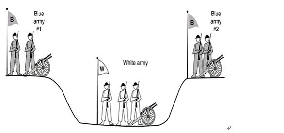
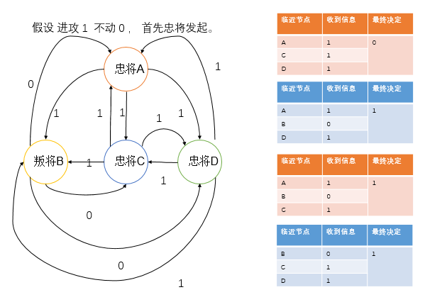
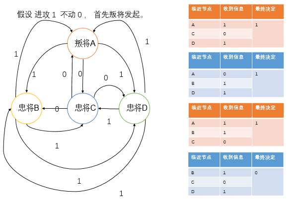

# 第9章 IPFS Cluster 与分布式系统

## 9.1 分布式系统概述

分布式系统是一个硬件或软件组件分布在不同的网络计算机上，彼此之间仅仅通过消息传递进行通信和协调的系统。

分布式系统使我们能够做到系统的水平扩展，我们只需要添加更多的机器而不是升级某台机器的硬件。

在某个阈值之后，水平扩展变得更便宜

### 9.1.1 分布式系统的难点

**网络因素**

由于服务和数据分布在不同的机器上，每次交互都需要跨机器运行，这带来如下几个问题：

+ 网络延迟：性能、超时，同机房的网络比较快，但是跨机房，尤其是跨 IDC，网络就成为不可忽视的性能瓶颈了。带宽增加只是成本的问题，但延迟是物理限制，基本不可能降低，这会导致系统整体性能的降低，会带来一系列的问题，比如资源的锁住，所以系统调用一般都要设置超时，针对这个问题采取的解决方案有：异步，重试。 而对于跨 IDC 数据分布带来的巨大网络因素影响，则一般会
采用数据同步，代理专线等处理方式。
+ 网络故障：丢包、乱序、抖动。 这个可以通过将服务建立在可靠的传输协议上来解决，比如TCP协议。不过带来的是更多的网络交互，因此是性能和流量的一个权衡。

**CAP 定理**

CAP 定理是加州大学的计算机科学家 Eric Brewer 在1998年提出的，它指的是在一个分布式系统中，Consistency（一致性）、 Availability（可用性）、Partition tolerance（分区容错性），三者不可兼得。

CAP 原理告诉我们，这三个因素最多只能满足两个，不可能三者兼顾。对于分布式系统来说，分区容错是基本要求，所以必然要放弃一致性。对于大型网站来说，分区容错和可用性的要求更高，所以一般都会选择适当放弃一致性。对应 CAP 理论，NoSQL 追求的是 AP，而传统数据库追求的是 CA，这也可以解释为什么传统数据库的扩展能力有限的原因。

在 CAP 三者中，“可扩展性”是分布式系统的特有性质。分布式系统的设计初衷就是利用集群多机的能力处理单机无法解决的问题。当需要扩展系统性能时，一种做法是优化系统的性能或者升级硬件(scale up)，一种做法就是“简单”的增加机器来扩展系统的规模(scale out)。好的分布式系统总在追求”线性扩展性”，即性能可以随集群数量增长而线性增长。

可用性和可扩展性一般是相关联的，可扩展行好的系统，其可用性一般会比较高，因为有多个服务(数据)节点，不是整体的单点。所以分布式系统的所有问题，基本都是在一致性与可用性和可扩展性这两者之间的一个协调和平衡。对于没有状态的系统，不存在一致性问题，根据CAP原理，它们的可用性和分区容忍性都是很高，简单的添加机器就可以实现线性扩展。而对于有状态的系统，则需要根据业务需求和特性在CAP三者中牺牲其中的一者。一般来说，交易系统类的业务对一致性的要求比较高，一般会采用ACID模型来保证数据的强一致性，所以其可用性和扩展性就比较差。而其他大多数业务系统一般不需要保证强一致性，只要最终一致就可以了，它们一般采用BASE模型，用最终一致性的思想来设计分布式系统，从而使得
系统可以达到很高的可用性和扩展性。

常见的分布式系统对于 CAP 三者的权衡，大家可以参考上图选择适合自己业务的系统。

**一致性模型**

一致性问题是分布式领域最为基础也是最重要的问题。如果分布式系统能实现“一致”，对外就可以呈现为一个完美的、可扩展的“虚拟节点”，相对物理节点具备更优越性能和稳定性。这也是分布式系统希望能实现的最终目标。

一致性并不代表结果正确与否，而是系统对外呈现的状态一致与否；例如，所有节点都达成失败状态也是一种一致。

将可能引发不一致的并行操作进行串行化 。这实际上也是现代分布式系统处理一致性问题的基础思路。

实现绝对理想的严格一致性 （strict consistency）代价很大。除非系统不发生任何故障，而且所有节点之间的通信无需任何时间，这个时候整个系统其实就等价于一台机器了。实际上，越强的一致性要求往往会造成越弱的处理性能，以及越差的可扩展性。

一致性的模型主要有3种：

+ Strong Consistency（强一致性）：新的数据一旦写入，在任意副本任意时刻都能读到新值。
+ Week Consistency（弱一致性）：不同副本上的值有新有旧，需要应用方做更多的工作获取最新值。
+ Evantual Consistency（最终一致性）：一旦更新成功，各副本的数据最终将达到一致。

从这三种一致型的模型上来说，Weak 和 Eventually 一般来说是异步冗余的，而 Strong 一般来说是同步冗余的(多写)，异步的通常意味着更好的性能，但也意味着更复杂的状态控制。同步意味着简单，但也意味着性能下降。

## 9.2 分布式存储中的数据分布算法

### 9.2.1 Hash方式分布

哈希方式是最常见的数据分布方式，其方法是按照数据的某一特征计算哈希值，并将哈希值与
机器中的机器建立映射关系，从而将不同哈希值的数据分布到不同的机器上。所谓数据特征可以是
key-value 系统中的 key，也可以是其他与应用业务逻辑相关的值。

这种方式的缺点很明显：1. 扩展性差 2.容易出现数据倾斜。

### 9.2.2 数据范围分布

需要记录所有的数据分布情况，需要使用专门的服务器在内存中维护数据分布信息（元数据）。

缺点： 元数据规模非常庞大

### 9.2.3 数据量分布

将这个文件按照某一较为固定的大小划分为若干数据块（chunk），不同的数据块分布到不同的服务器上。同样需要记录数据块的具体分布情况，没有数据倾斜的问题。

缺点： 需要管理复杂的元数据，元数据规模较大

### 9.2.4 一致性Hash

一致性哈希（consistent hashing）是另一个种在工程中使用较为广泛的数据分布方式。一致性哈
希最初在 P2P 网络中作为分布式哈希表（DHT）的常用数据分布算法。一致性哈希的基本方式是使
用一个哈希函数计算数据或数据特征的哈希值，令该哈希函数的输出值域为一个封闭的环，即哈希
函数输出的最大值是最小值的前序。将节点随机分布到这个环上，每个节点负责处理从自己开始顺
时针至下一个节点的全部哈希值域上的数据。

优点：

可扩展性：极好。任意动态添加、删除节点，只影响相邻节点

缺点：

+ 元信息：大而且复杂
+ 随机分布节点容易造成不均匀
+ 动态增加节点后只能缓解相邻节点
+ 一个接点异常时压力全转移到相邻节点

**虚节点**

虚节点，虚节点个数远大于机器个数，将虚节点均匀分布到值域环上，通过元数据找到真实机器节点。

优点：

+ 某一个节点不可用导致多个虚节点不可用，均衡了压力
+ 加入新节点导致增加多个虚节点，缓解了全局压力

### 9.2.5 区块链存储

分布式存储（P2P 存储）

通过 Token 激励，鼓励大家共享存储资源，参与构建一个全世界范围内的分布式存储系统。

代表项目：

+ IPFS+FileCoin （ S/Kademlia ）
+ Storj
+ Sia

## 9.3 分布式系统的共识算法

共识 （consensus）在很多时候会与一致性 （consistency）术语放在一起讨论。严谨地讲，两者的含义并不完全相同。

一致性往往指分布式系统中多个副本对外呈现的数据的状态。顺序一致性、线性一致性，描述了多个节点对数据状态的维护能力。而共识则描述了分布式系统中多个节点之间，彼此对某个状态达成一致结果的过程。因此，一致性描述的是结果状态，共识则是一种手段。达成某种共识并不意味着就保障了一致性。

实践中，要保障系统满足不同程度的一致性，核心过程往往需要通过共识算法来达成。

一般地，把出现故障（crash或fail-stop，即不响应）但不会伪造信息的情况称为“非拜占庭错误”（non-byzantine fault）或“故障错误”（Crash Fault）；伪造信息恶意响应的情况称为“拜占庭错误”（Byzantine Fault），对应节点为拜占庭节点。

### 9.3.1 FLP 不可能原理

共识问题的最坏界限在哪里呢？在推广到任意情形时，分布式系统的共识问题无通用解。这个结论称为“FLP不可能原理”。

FLP不可能原理： 在网络可靠，但允许节点失效（即便只有一个）的最小化异步模型系统中，不存在一个可以解决一致性问题的确定性共识算法（No completely asynchronous consensus protocol can tolerate even a single unannounced process death）。

提出并证明该定理的论文《Impossibility of Distributed Consensus with One Faulty Process》由Fischer、Lynch和Patterson三位科学家于1985年发表，该论文后来获得了 Dijkstra（就是发明最短路径算法的那位计算机科学家）奖。

FLP不可能原理实际上告诉人们，不要浪费时间，去为异步分布式系统设计在任意场景下都能实现共识的算法 。

### 9.3.2 非拜占庭问题的共识算法

### Paxos 协议

Paxos 算法是莱斯利·兰伯特（Leslie Lamport）于1990年提出的一种基于消息传递的一致性算法。 Paxos 算法是一个解决分布式系统中，多个节点之间就某个值（注意是某一个值，不是一系列值）达成一致的通信协议。能够处理在少数派离线的情况下，剩余的多数派节点仍然能够达成一致。

Paxos 能保证在超过 ½ 的正常节点存在时，系统能达成共识。

注意：Paxos 过程中不存在拜占庭将军问题（消息不会被篡改）和两将军问题（信道可靠）。

简单说来，Paxos 的目的是让整个集群的结点对某个值的变更达成一致。Paxos 算法基本上来说是个民主选举的算法——大多数的决定会成个整个集群的统一决定。任何一个点都可以提出要修改某个数据的提案，是否通过这个提案取决于这个集群中是否有超过半数的结点同意（所以 Paxos 算法需要集群中的结点是单数）。

这个算法有两个阶段（假设这个有三个结点：A，B，C）：

**第一阶段：Prepare阶段**

A 把申请修改的请求 Prepare Request 发给所有的结点A，B，C。注意，Paxos 算法会有一个Sequence Number（你可以认为是一个提案号，这个数不断递增，而且是唯一的，也就是说 A 和 B 不可能有相同的提案号），这个提案号会和修改请求一同发出，任何结点在“Prepare阶段”时都会拒绝其值小于当前提案号的请求。所以，结点A在向所有结点申请修改请求的时候，需要带一个提案号，越新的提案，这个提案号就越是是最大的。

如果接收结点收到的提案号 n 大于其它结点发过来的提案号，这个结点会回应 Yes（本结点上最新的被批准提案号），并保证不接收其它`<n`的提案。这样一来，结点上在 Prepare 阶段里总是会对最新的提案做承诺。

优化：在上述 prepare 过程中，如果任何一个结点发现存在一个更高编号的提案，则需要通知 提案人，提醒其中断这次提案。

**第二阶段：Accept阶段**

如果提案者A收到了超过半数的结点返回的 Yes，然后他就会向所有的结点发布 Accept Request（同样，需要带上提案号 n），如果没有超过半数的话，那就返回失败。

当结点们收到了 Accept Request 后，如果对于接收的结点来说，n 是最大的了，那么，它就会修改这个值，如果发现自己有一个更大的提案号，那么，结点就会拒绝修改。

更多关于 Paxos 算法的细节请参考 [Paxos Wiki](https://zh.wikipedia.org/zh/Paxos%E7%AE%97%E6%B3%95)

### Raft 算法

2013年斯坦福的Diego Ongaro、John Ousterhout，提出了新的更易理解和实现的一致性算法( In Search of an Understandable Consensus Algorithm )，即Raft。

Paxos自1990年提出以后，相当长时间内几乎已成为分布式一致性算法的代名词。但因其难以理解和实现，目前知名实现仅有Chubby、Zookeeper、libpaxos几种，其中Zookeeper使用的ZAB对Paxos做了大量改进。

Raft协议在功能上是完全等同于(Multi)-Paxos协议

在 IPFS Cluster 中采用了 Raft 协议。

在Raft中，每个结点会处于下面三种状态中的一种：

+ Follower 选民：所有结点都以follower的状态开始。如果没收到leader消息则会变成candidate状态
+ Candidate 候选人：会向其他结点“拉选票”，如果得到大部分的票则成为leader。这个过程就叫做Leader选举(Leader Election)
+ Leader 领导者：所有对系统的修改都会先经过leader。每个修改都会写一条日志(log entry)。leader收到修改请求后的过程如下，这个过程叫做日志复制(Log Replication)： 
	+ 复制日志到所有follower结点(replicate entry)
	+ 大部分结点响应时才提交日志
	+ 通知所有follower结点日志已提交
	+ 所有follower也提交日志
	+ 现在整个系统处于一致的状态

大体分为2个过程：

+ 选举(Leader Election)
+ 日志同步(Log Replication)

**选举**

选举和现实社会中的民主选举制度很像，当 Follower 超过选举超时时间(election timeout)没收到来自 Leader 的心跳报文，则成为 Candidate，增加任期(Term)并向其他节点发起新的选举请求。接收到请求的节点如果还没投票则投票给该节点，并重置自己的超时时间。如果获取到了超过一半的赞同票，则成为新的 Leader。每隔一定时间向 Follower 发送心跳报文来维持自己的”统治”地位。

那么，万一有多个节点获得了同样的投票怎么办呢？

此时则等待各自的超时时间后，增加 Term 后再次发起投票。解决这个问题的关键在于 每个节点的election timeout 是不同的。

**日志同步**

当选举完成后，客户端进行的操作都要通过 Leader 来进行。首先 Leader 接受到客户端发来的操作请求后记录到日志中，此时为 uncommitted 状态。然后在下一个心跳报文中通知所有 Follower，当大多数 Follower 响应后，Leader 响应客户端，进入 committed 阶段，并向 Follower 发送通知应用(apply)操作。

**脑裂**

如果由于网络分区(network partition)造成同时有多个 Leader，这种情况下某些 Leader 由于获取不到大多数的投票，所以数据永远不会提交成功。当网络故障恢复后，旧的 Leader 发现有 Term 更新的Leader 存在，则自动降级为 Follower 并从最新的 Leader 同步数据达成集群一致。

这里强烈建议大家通过这个[动画视频](http://thesecretlivesofdata.com/raft/
)来理解 raft 算法。

### 9.3.3 两军问题

Two Generals Problem 两将军问题是这么一个思维性实验问题： 有两支军队，它们分别有一位将军领导，现在准备攻击一座修筑了防御工事的城市。这两支军队都驻扎在那座城市的附近，分占一座山头。一道山谷把两座山分隔开来，并且两位将军唯一的通信方式就是派各自的信使来往于山谷两边。不幸的是，这个山谷已经被那座城市的保卫者占领，并且存在一种可能，那就是任何被派出的信使通过山谷是会被捕。 请注意，虽然两位将军已经就攻击那座城市达成共识，但在他们各自占领山头阵地之前，并没有就进攻时间达成共识。两位将军必须让自己的军队同时进攻城市才能取得成功。因此，他们必须互相沟通，以确定一个时间来攻击，并同意就在那时攻击。如果只有一个将军进行攻击，那么这将是一个灾难性的失败。 这个思维实验就包括考虑他们如何去做这件事情。下面是我们的思考：

1. 第一位将军先发送一段消息“让我们在上午9点开始进攻”。然而，一旦信使被派遣，他是否通过了山谷，第一位将军就不得而知了。任何一点的不确定性都会使得第一位将军攻击犹豫，因为如果第二位将军不能在同一时刻发动攻击，那座城市的驻军就会击退他的军队的进攻，导致他的军对被摧毁。

2. 知道了这一点，第二位将军就需要发送一个确认回条：“我收到您的邮件，并会在9点的攻击。”但是，如果带着确认消息的信使被抓怎么办？所以第二位将军会犹豫自己的确认消息是否能到达。

3. 于是，似乎我们还要让第一位将军再发送一条确认消息——“我收到了你的确认”。然而，如果这位信使被抓怎么办呢？

4. 这样一来，是不是我们还要第二位将军发送一个“确认收到你的确认”的信息。

于是你会发现，这事情很快就发展成为不管发送多少个确认消息，都没有办法来保证两位将军有足够的自信自己的信使没有被敌军捕获。

这个问题是无解的。两个将军问题和它的无解证明首先由E.A.Akkoyunlu,K.Ekanadham和R.V.Huber于1975年在《一些限制与折衷的网络通信设计》一文中发表，就在这篇文章的第73页中一段描述两个黑帮之间的通信中被阐明。 1978年，在Jim Gray的《数据库操作系统注意事项》一书中（从第465页开始）被命名为两个将军悖论。作为两个将军问题的定义和无解性的证明的来源，这一参考被广泛提及。

这个实验意在阐明：试图通过建立在一个不可靠的连接上的交流来协调一项行动的隐患和设计上的巨大挑战。

从工程上来说，一个解决两个将军问题的实际方法是使用一个能够承受通信信道不可靠性的方案，并不试图去消除这个不可靠性，但要将不可靠性削减到一个可以接受的程度。比如，第一位将军排出了100位信使并预计他们都被捕的可能性很小。在这种情况下，不管第二位将军是否会攻击或者受到任何消息，第一位将军都会进行攻击。另外，第一位将军可以发送一个消息流，而第二位将军可以对其中的每一条消息发送一个确认消息，这样如果每条消息都被接收到，两位将军会感觉更好。然而我们可以从证明中看出，他们俩都不能肯定这个攻击是可以协调的。他们没有算法可用（比如，收到4条以上的消息就攻击）能够确保防止仅有一方攻击。再者，第一位将军还可以为每条消息编号，说这是1号，2号……直到n号。这种方法能让第二位将军知道通信信道到底有多可靠，并且返回合适的数量的消息来确保最后一条消息被接收到。如果信道是可靠的话，只要一条消息就行了，其余的就帮不上什么忙了。最后一条和第一条消息丢失的概率是相等的。

### 9.3.4 拜占庭将军问题

两军问题和拜占庭将军问题有一定的相似性，通信兵得经过敌人的沟渠，在这过程中他可能被捕，也就是说，两军问题中信道是不可靠的，并且其中没有叛徒之说，这就是两军问题和拜占庭将军问题的根本性不同。

两军问题的根本问题在于信道的不可靠，反过来说，如果传递消息的信道是可靠的，两军问题可解。

拜占庭问题又叫拜占庭将军问题（Byzantine Generals Problem），是Leslie Lamport等科学家于1982年提出用来解释一致性问题的一个虚构模型。拜占庭是古代东罗马帝国的首都，由于地域宽广，守卫边境的多个将军（系统中的多个节点）需要通过信使来传递消息，达成某些一致的决定。但由于将军中可能存在叛徒（系统中节点出错），这些叛徒将努力向不同的将军发送不同的消息，试图干扰共识的达成。拜占庭问题即为在此情况下，如何让忠诚的将军们能达成行动的一致。
论文中指出，对于拜占庭问题来说，假如节点总数为N，叛变将军数为F，则当N≥3F+1时，问题才有解，由BFT算法进行保证。

Leslie Lamport等人在论文《Reaching agreement in the presence of faults》中证明，当叛变者不超过1/3时，存在有效的拜占庭容错算法（最坏需要F+1轮交互）。反之，如果叛变者过多，超过1/3，则无法保证一定能达到一致结果。

能确保达成一致的拜占庭系统节点数至少为4，此时最多允许出现1个坏的节点

拜占庭容错算法（Byzantine Fault Tolerant，BFT）是面向拜占庭问题的容错算法，解决的是在网络通信可靠但节点可能故障情况下如何达成共识。拜占庭容错算法最早的讨论在1980年Leslie Lamport等人发表的论文《Polynomial Algorithms for Byzantine Agreement》，之后出现了大量的改进工作。长期以来，拜占庭问题的解决方案都存在复杂度过高的问题，直到PBFT算法的提出。

1999年，Castro和Liskov于论文《Practical Byzantine Fault Tolerance and Proactive Recovery》中提出的Practical Byzantine Fault Tolerant（PBFT）算法，基于前人工作进行了优化，首次将拜占庭容错算法复杂度从指数级降低到了多项式级，目前已得到广泛应用。其可以在失效节点不超过总数1/3的情况下同时保证Safety和Liveness。

PBFT算法采用密码学相关技术（RSA签名算法、消息验证编码和摘要）确保消息传递过程无法被篡改和破坏。

在区块链中我们需要解决的是**拜占庭将军问题**，而在企业的分布式系统中，我们只需要解决**非拜占庭问题**。

### 参考资料

[分布式系统原理介绍](https://blog.csdn.net/sunyurun/article/details/8297419)

[一致性hash算法简介](http://blog.huanghao.me/?p=14)

[Paxos 算法](https://zh.wikipedia.org/zh/Paxos%E7%AE%97%E6%B3%95)

[Raft 算法](https://zh.wikipedia.org/zh/raft)

[分布式系统的事务处理](https://coolshell.cn/articles/10910.html)

####

- [目录](SUMMARY.md)
- 上一节：[IPFS 网络层](08.0.md)
- 下一节：[深入理解 IPFS Cluster](09.2.md)