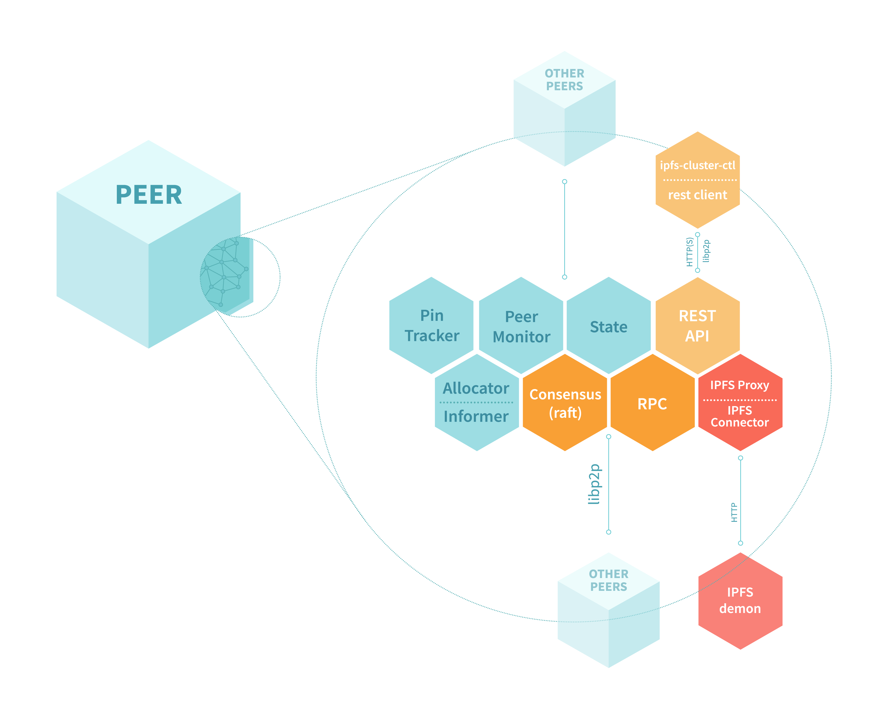
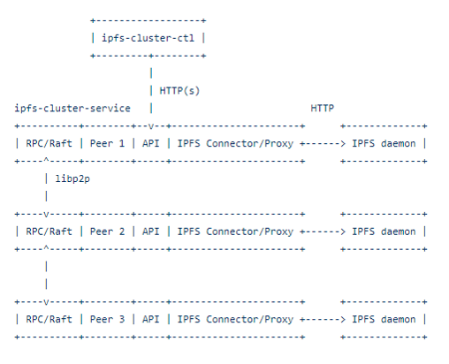

# 9.2 深入理解 IPFS Cluster

在本节中我们将深入了解 IPFS Cluster 架构与实现

## 模块化

IPFS  Cluster 在设计时尽可能模块化，通过定义模块（组件）之间的接口来解耦，达到以下目的：

+ 在不影响系统其余部分的情况下，可以方便的将其中某一部分替换为其他实现。
+ 易于分开测试。

## 组件

IPFS Cluster 包括：

+ 接口和类型的定义（`ipfscluster.go`）
+ 集群组件和 API （`cluster.go`）
	+ API：暴露出去供其他人使用的 REST API 接口。
	+ IPFSConnector：IPFS daemon 的代理组件，默认为：`ipfshttp`。
	+ State：由共识层维持的 pins 列表。默认为：`mapstate`。
	+ PinTracker：跟踪 pinset 的组件，确保它被`ipfs daemon`持久化。默认为：`maptracker`。
	+ PeerMonitor：用于记录节点信息、检测节点故障的组件。默认值：pubsubmon
	+ PinAllocator：用于在给定条件下，决定哪些节点固定 cid。默认值：Descendalloc
	+ Informer：`PinAllocator` 和 `PeerMonitor` 通过它收集系统指标，默认收集磁盘。
+ 共识组件，`go-libp2p-raft` 和 `go-libp2p-consensus`,默认采用 raft 算法。 

## 共识算法

IPFS Cluster 在设计的时候就考虑到将来可能根据不同的情况采用不同的共识算法。因此在设计共识层的时候主要基于以下考虑：

+ 在所有节点上维持对`pinset`的**一致性视图**。
+ 在一部分节点上采用不同的共识算法。

所以 IPFS Cluster 的共识层设计得非常灵活，大家可以根据自己的需要来选择。

### Raft

Raft 算法被作为 IPFS Cluster 共识层的算法，主要基于以下考虑：

+ 在小集群范围内，Raft 算法很容易理解并且现在的分布式系统中大量采用了 Raft 算法，大量正在生产上运行的系统证明了它的可靠性。
+ Raft 提供了强一致性并且能够防止网络分裂。
+ 基于 Raft 协议的 Golang 实现`hashicorp/raft` 很容易迁移到 `go-libp2p-consensus` 中。

在 Raft 算法中所有对系统的修改都会先经过 leader。每个修改都会写一条日志，然后复制日志到所有 follower 结点。在 IPFS Cluster 中每次发送`Pin`和`Unpin`请求都会产生一条日志。例如：当节点接收到日志`Pin`操作时，它会更新处于共享状态(shared state)的本地副本，表示当前`CID`已经被固定住。

当我们执行命令`ipfs-cluster-ctl pin add <cid>` ，我们会调用 API 发送`Pin`请求，然后这个请求会被转发到 Leader 节点，然后由 Leader 节点执行提交操作，并且通知所有的节点。

`peer add` 和 `peer remove` 操作同样的也是基于 Raft 算法进行处理。

默认情况下，共识算法产生的数据存储在 `raft` 目录下。该文件夹存储两类文件：

+ Raft 日志（存储在 boltDB 数据库中）
+ 快照

当日志变得太大时，会定期执行日志中的快照。当一个节点的状态远远落后于需要执行的日志，Raft 可能会选择直接发送快照，而不是单独发送组成该状态的每个日志条目。删除或重命名 raft 文件夹可以有效地将节点重置为初始状态。

注意：在运行集群时，**不要**在共识数据文件夹**包含**来自其他集群的数据，不然会引发混乱。

## 状态

在 IPFS Cluster 中的数据包含有三种状态：

1. 共享状态（shared state）：处于这种状态下数据由共识算法进行处理，它被拷贝到集群中的每个节点。共享状态的数据存储着需要被 IPFS Cluster 监控的 CIDs 列表，以及复制因子、名称和其他的一些相关信息。
2. 本地状态（local state）：每个节点单独维持的状态
3. IPFS 状态（IPFS state）：ipfs 中的真正状态（可以通过 `ipfs pin ls` 查看），由 ipfs 的守护进程来维持。

在正常情况下，这三种状态是同步的。我们对共享状态的更新，会触发本地状态和 ipfs 状态的同步改变。可以通过如下命令查看这三种状态：

+ `ipfs-cluster-ctl pin ls` 显示共享状态的信息。
+ `ipfs-cluster-ctl status` 显示集群相关节点的本地状态信息。它通过聚合从集群节点收到的本地状态信息来实现。
+ `ipfs pin ls` 查看 IPFS 状态。我们可以使用`ipfs-cluster-ctl sync`命令确保本地状态和 IPFS 状态同步。

## 向集群固定（Pin） CID 流程

当我们使用命令`ipfs-cluster-ctl pin add <cid>` 向 IPFS Cluster 添加或者固定一个 CID 时,基于默认的 Raft 算法实现，它大体的流程如下：

1. 选出哪些节点用来 pin 分配的 CID, 取决于复制因子的大小和分配策略。
2. 将 pin 请求转发给 Leader 节点。
3. 在日志中记录提交的条目。
4. 此时，将返回成功或者失败消息给调用者。调用者流程结束，集群继续向下处理。
5. 接收更新消息日志并相应地修改共享状态。
6. 更新本地状态
7. 如果节点已分配此内容，则：
	1. 将 pin 请求加入队列，并且更新状态为 `PINNING`
	2. 触发 pin 操作
	3. 等待操作结束，设置状态为 `PINNED`

如果在提交日志前发生错误，将会返回用户错误信息，然后中止整个操作。如果在提交日志后发生错误，将会导致 pins 的状态为'PIN_ERROR'。

决定 CID 将会 pin 在哪些节点之上是一个复杂的过程。所有适合的节点（正常心跳报告的节点）将会根据分配策略进行排序，如果 CID 已经分配给某些节点，将会触发 `re-pinning` 操作。

当分配因子低于 `replication_factor_min` 的时候将会触发新的分配。如果 `replication_factor_min` 和 `replication_factor_max` 被设置为 `-1` 意味着每一个节点都会固定这个 CID（即数据被复制到任何一个节点）。

如果我们更改配置中设置的默认复制因子，我们需要重新执行`re-pinning`操作。我们可以使用`ipfs cluster ctl pin ls<cid>`检查 pin 的详细信息，包括复制因子。也可以使用`ipfs cluster ctl pin add<cid>`在有不同复制因子的时候重新 pin。但注意，新的 PIN 只有在与现有的 PIN 不同的情况下才会被提交。 

我们可以用`ipfs-cluster-ctl status <cid>`来检查 pin 的状态，也可以使用`ipfs cluster ctl recover<cid>`来触发对处于错误状态的 pin 的恢复。

同时触发的多次 `pin/unpin`请求将会加入队列，进行排队。

## 取消固定（Unpinning）条目

`ipfs-cluster-ctl pin rm <cid>` 操作将会触发集群取消固定 CID。

这个过程与上面的**固定条目**非常相似,这个操作将会在共享状态和本地状态中清除掉此 CID,当你再次访问此 CID 时，它显示的状态为`UNPINNED`, 

## 增加条目

`ipfs cluster ctl add<args>` 操作将会向集群中增加条目，集群使用与`go ipfs`相同的方式来划分和创建 DAG。文件会被分为很多`block` 然后，发送请求到 `/add` 接口去添加进集群。

集群实现了 adder 模块，通过`clusterDagServices` 实现 `ipld.DAGService` 接口来处理存储操作：

+ 本地的集群 DAG 服务将会把条目添加到集群内的节点
+ 共享的集群 DAG 服务将会把条目添加到跨集群的多个节点

## DHT 服务

集群组件将`go-libp2p-kad-dht`服务连接到libp2p的主机。然后创建一个路由主机，该主机使用 DHT 作为节点路由。这允许从其他节点检索`peer.id`的 multiaddreses。

目前 DHT 采用 Kademlia 来实现。其他节点的 ID 可以与当前节点的距离进行排序和分类，优先存储那些更接近自身的 ID。当一个 Peer ID 找不到请求地址时，就会与最近的已知节点发起请求。然后重复这个过程，直到我们到达一个足够近的节点，它存储了我们正在寻找的 peer.id。

目前我们不使用DHT存储任何信息，只用于节点发现（路由）。

DHT 网络在启动时，首先会连接引导节点，只有先连接上引导节点才能发现和访问其他节点。

+ 当用户第一次启动 IPFS 时，我们要求他们在节点的存储文件中至少有一个节点的地址。（初始化的时候就设置好了）
+ 在关闭时，我们要将所有已知的节点地址保存到节点的存储文件中。

使用 DHT 的一个好处是，我们不需要让每个节点都连接起来，它们在启动或者加入集群时就知道其他人的地址。当他们需要连接时，通过使用 DHT 根据需要找到其他节点。

### 参考资料

####

- [目录](SUMMARY.md)
- 上一节：[IPFS Cluster 与分布式系统](09.1.md)
- 下一节：[IPFS Cluster 安装与配置](09.3.md)
