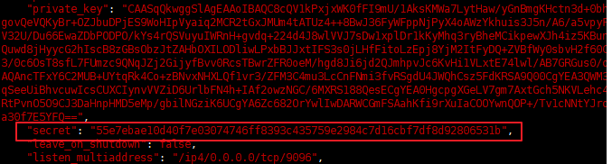

# 9.3 IPFS Cluster 安装与配置

IPFS 提供了一套方案来解决当需要同时管理多台节点时同步文件的不便之处。通过 ipfs-cluster-service 和 ipfs-cluster-ctl 对所有节点进行统一管理。主要功能为实现在管理节点统一上传文件、pin 文件和删除文件。

其中 ipfs-cluster-service 为服务端，ipfs-cluster-ctl 为管理端。所有节点都需要安装 ipfs-cluster-service，其中只有管理节点安装 ipfs-cluster-ctl。他们的依赖关系为：

	ipfs-cluster-ctl
		|
		v
	ipfs-cluster-service
		|
		v
	  ipfs

ipfs-cluster-service 安装包 [下载地址](https://dist.ipfs.io/#ipfs-cluster-service)

ipfs-cluster-ctl 安装包 [下载地址](https://dist.ipfs.io/#ipfs-cluster-ctl)

## 集群安装

+ 所有节点安装 IPFS，详细见：[配置 IPFS 开发环境](02.4.md)
+ 在所有节点当中安装 ipfs-cluster-service
	- 解压缩安装包，并拷贝启动脚本
	
			tar -zxvf ipfs-cluster-service_v0.5.0_linux-amd64.tar.gz
			cp ipfs-cluster-service/ipfs-cluster-service /usr/bin

	- 初始化 ipfs-cluster-service

			ipfs-cluster-service init

		注意，此时会生成 ipfs-cluster-service 的 id，在配置文件`/root/.ipfs-cluster/service.json` 和 ipfs 的 id 不同，不要将两者搞混。

	- 修改配置文件的 secret 码

		ipfs-cluster-service 的 secret 码是初始化时随机生成的32位字符串，如果想要搭建出集群管理需要手动将所有节点的 secret 码替换成一样的，可以直接选取集群的管理节点的 secret 码，为其他节点进行替换

			vim /root/.ipfs-cluster/service.json

		

		复制此行，直接在其他节点进行替换即可，之后保存并退出。

+ 在集群管理节点安装 ipfs-cluster-ctl
	- 解压缩安装包，并拷贝启动脚本

			tar -zxvf ipfs-cluster-ctl_v0.5.0_linux-amd64.tar.gz
			cp ipfs-cluster-ctl/ipfs-cluster-ctl /usr/bin

		无需初始化，可直接运行

+ 启动ipfs-cluster-serivce
	- 启动管理节点的 ipfs-cluster-serivce

			ipfs-cluster-serivce daemon &

		在启动过程中会弹出 ipfs-cluster-serivce 的 id 信息，记录下来后面会用到。

	- 启动其他节点的ipfs-cluster-serivce（管理节点信息在 ipfs-cluster-serivce 启动时可以看到）

			ipfs-cluster-service daemon --bootstrap <管理节点id信息>

	看到*IPFS Cluster is READY*，则表示启动成功。

至此，IPFS-Cluster 管理集群已搭建完毕。

## IPFS Cluster 管理

+ 统一上传文件

		ipfs-cluster-ctl add <文件名>

	该命令可统一上传文件，并且自动在其他节点进行pin命令。

+ 统一pin文件

		ipfs-cluster-ctl pin add

+ 统一删除文件
		
		ipfs-cluster-ctl pin rm 

	但需要在其他节点上手动进行`ipfs repo gc`

+ 查看通过	ipfs-cluster-ctl	上传过的文件

		ipfs-cluster-ctl pin ls

+ 查看	cluster	集群中联通了哪些节点

		ipfs-cluster-ctl peers ls

+ 从集群中删除某一节点

		ipfs-cluster-ctl peers rm <节点id（短hash）>

+ 可查看集群中文件的同步状态，此命令在某一节点删除文件后有延迟，延迟时间尚不确定

		ipfs-cluster-ctl status

+ 跟踪集群中文件的同步状态，与上面命令不一样，只会显示同步出现异常的文件，并且可以刷新`ipfs-cluster-ctl status`的执行结果

		ipfs-cluster-ctl sync

### 参考资料

####

- [目录](SUMMARY.md)
- 上一节：[深入理解 IPFS Cluster](09.2.md)
- 下一节：[基于 IPFS 视频网站](10.0.md)
