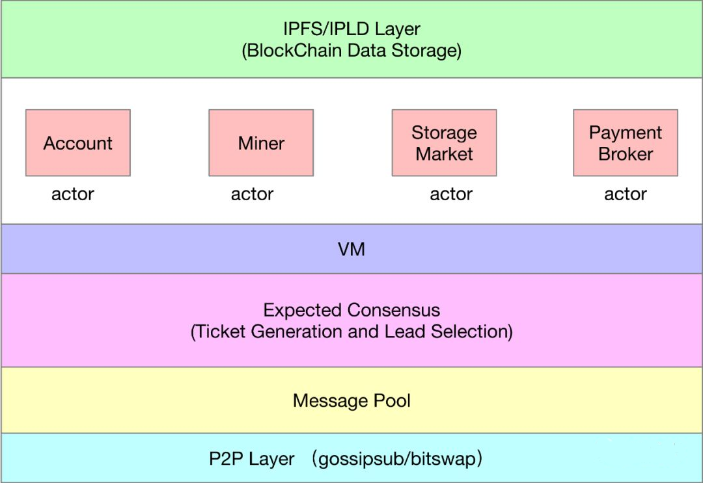
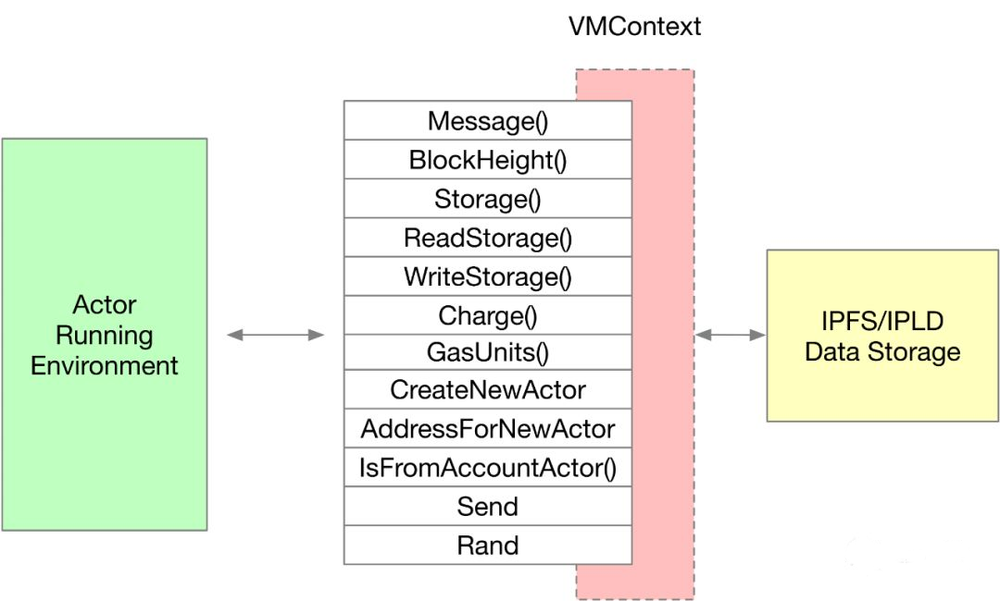
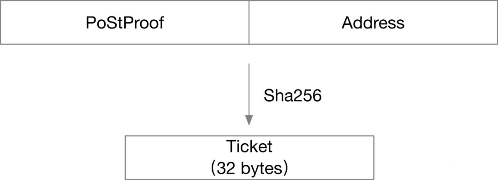
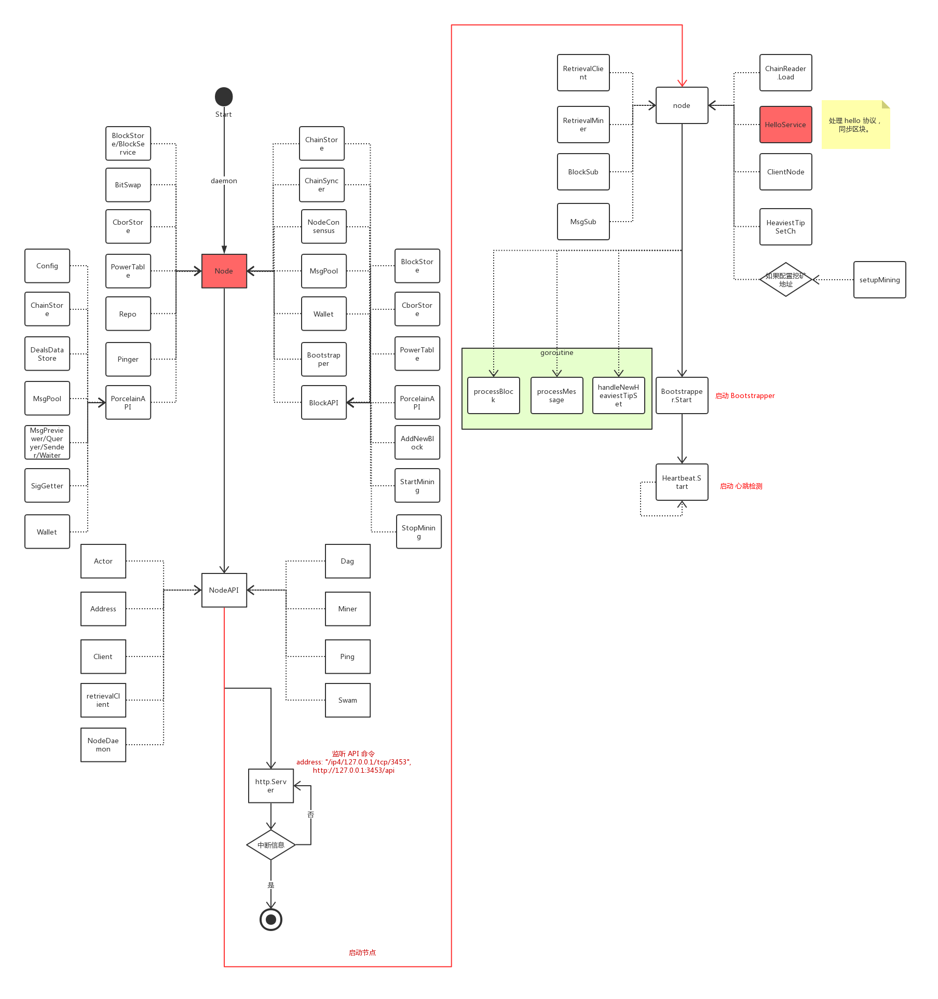
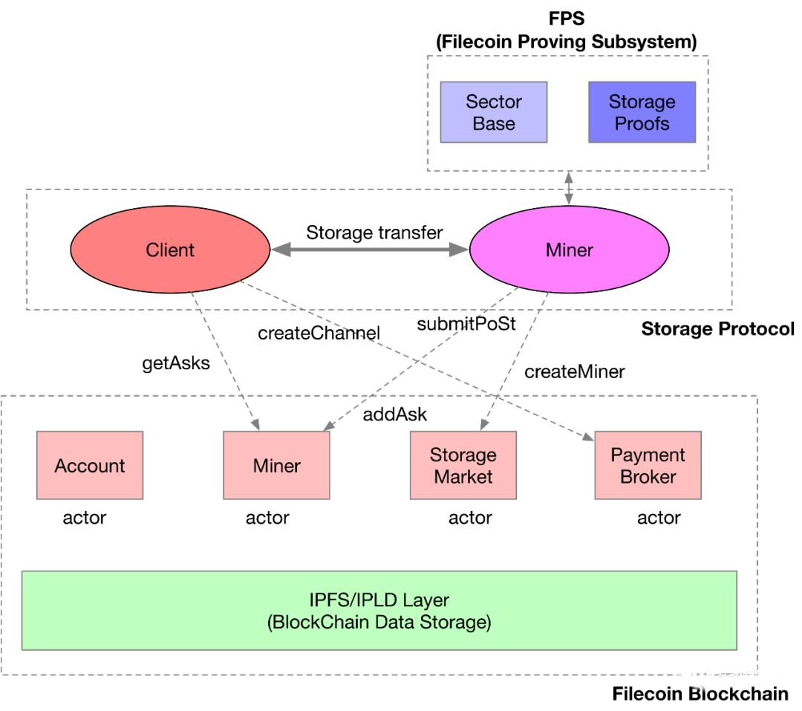
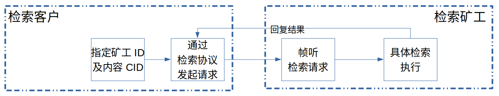
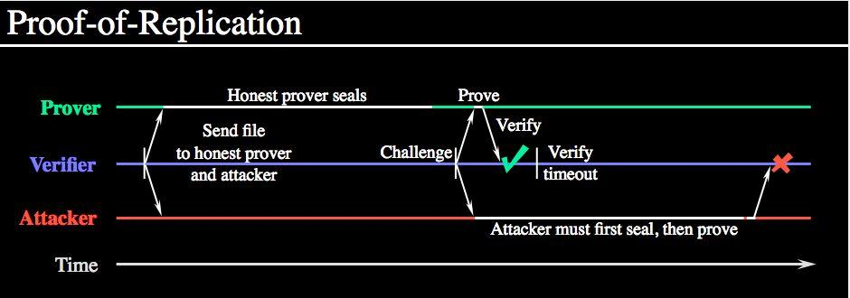

## 第十章：FileCoin

## FileCoin 简介

Filecoin是一个去中心化的存储网络（**DSN**），是一个**云存储的自由交易市场**，通过Filecoin**项目**来实现其**协议**。

在 Filecoin 的网络里，矿工通过提供存储或者检索资源来赚钱 Token(FIL), 客户付钱给矿工存储或检索数据

Filecoin包含多重含义：

+ 网络

- 市场
- 项目
- 协议
- Token

### Filecoin 的设计目的

+ filecoin设计符合激励相容，每一个参与者的最有利可图的选择（包括目标客户，矿工，投资者和开发人员）将是采取行动提高网络服务质量，这也是他们的最优策略。

+ 以超高竞争力的价格可靠地存储文件（低成本、高效率）

+ 客户可以调整其存储策略以满足他们的需求，在冗余，检索速度和成本之间创建自定义平衡。全球的 Filecoin 存储和检索市场使供应商竞争以最优惠的价格为客户提供灵活的选择

### Filecoin 与 IPFS 的关系

Filecoin 和 IPFS 都是 IPFS 协议实验室提出的，他们都属于协议实验室，Filecoin 是 IPFS 的补充协议。IPFS 作为一个开源项目已经被很多系统在使用， 它允许节点之间相互请求，传输，和存储可验证的数据，但是节点之间并没有形成一个统一的网络，各个节点都是各自存储自己认为重要的数据， 没有简单的方法可以激励他人加入网络或存储特定数据。

Filecoin 的出现就是为了解决这一关键问题，它旨在提供一个可以用来持久存储的系统，作为 IPFS 的激励层。

|   类别   | IPFS                             | Filecoin                                                     |
| :------: | :------------------------------- | :----------------------------------------------------------- |
|   功能   | 基于内容寻址的分布式存储基础设施 | IPFS网络之上的激励层，提供一个云存储领域的自由交易市场       |
| 存储权限 | 对有所有权的IPFS节点具备存储权限 | 1. 除对有所有权的IPFS节点具备存储权限外<br/>2. 还可以通过支付的方式，在其供应商的节点之上具备存储权限 |
| 读取权限 | ALL（只要知道内容cid）           | ALL（只要知道内容cid）                                       |
| 架构设计 | 去中心化存储市场，区块链         | 原则上需要无缝对接到IPFS，Filecoin将IPLD用于区块链数据结构 3.Filecoin节点使用libp2p建立彼此的安全连接 |
|          |                                  |                                                              |
|          |                                  |                                                              |
### Filecoin 竞争优势

| 特点                   | 传统云存储提供商                                             | Filecoin                                                     |
| ---------------------- | ------------------------------------------------------------ | ------------------------------------------------------------ |
| 网络模式               | 集中式                                                       | DSN                                                          |
| 加入门槛               | 高，从硬件底层基础设施、一直到软件、服务的提供，小企业很难插足 | 低、自由交易市场，Filecoin做好基础设施                       |
| 宏观视野：闲置存储空间 | 高                                                           | 低                                                           |
| 价格                   | 昂贵，垄断、可人为保持高水平                                 | 便宜，自由竞争市场                                           |
| 安全性                 | 差，破坏隐私，云存储上可查看用户隐私  甚至许多密码鉴权信息都没有隐私可言单个提供商的故障影响大 | 强，无第三方或者中心机构，文件加密安全得到保单个云提供商的故障小 |
| 利益分配群体           | 巨头                                                         | All                                                          |


### FIlecoin 角色

| 角色     | 说明                                                         | 主要影响因素 |
| -------- | ------------------------------------------------------------ | ------------ |
| 存储矿工 | 存储矿工通过为客户存储数据来获得Filecoin；获得区块奖励和交易费用的概率与矿工对Filecoin网络的存储量成正比 | 存储容量     |
| 检索矿工 | 检索矿工的带宽和交易的出价/响应时间（即延迟和与客户的接近度）将决定其在网络上关闭检索交易的能力 | 带宽         |
| 检索客户 | 支付filecoin获取检索服务                                     |              |
| 存储客户 | 付filecoin获取存储服务                                       |              |


## Filecoin 架构

### Filecoin 架构图


**Filecoin 功能分层**


### Filecoin 中的重要概念


**Filecoin State Machine (Filecoin状态机)**

[state-machine](https://github.com/filecoin-project/specs/blob/master/state-machine.md)

Filecoin的状态机，主要是维护如下一些状态信息：支付情况，存储市场情况，各个节点的Power（算力）等等。


**Actor**

[Filecoin State Machine Actors](https://github.com/filecoin-project/specs/blob/master/actors.md)

Filecoin网络中的 Actor 可以类比以太坊网络中的账户（一般账户或者智能合约账户）。每个Actor有自己的地址，余额，也可以维护自己的状态，同时 Actor 提供一些函数调用（也正是这些函数调用触发 Actor 的状态变化）。Filecoin的状态机，包括所有Actor的状态。

Actor 的状态，包括：账户信息（Balance），可执行代码（Code），以及序号（Nonce）。Actor的定义在`actor/actor.go` 中。


```
// Actor is the central abstraction of entities in the system.
// Both individual accounts, as well as contracts (user & system level) are
// represented as actors. An actor has the following core functionality implemented on a system level:
// - track a Filecoin balance, using the `Balance` field
// - execute code stored in the `Code` field
// - read & write memory
// - replay protection, using the `Nonce` field
//
// Value sent to a non-existent address will be tracked as an empty actor that has a Balance but
// nil Code and Memory. You must nil check Code cids before comparing them.
//
// More specific capabilities for individual accounts or contract specific must be implemented
// inside the code.
//
// Not safe for concurrent access.
type Actor struct {
	Code    cid.Cid `refmt:",omitempty"`
	Head    cid.Cid `refmt:",omitempty"`
	Nonce   types.Uint64
	Balance *types.AttoFIL
}
```


**Message**

Filecoin网络中的区块是由一个个的 Message 组成。你可以把 Message 想象成以太坊的交易。一个 Message 由发起地址，目标地址，金额，调用的函数以及参数组成。所有 Message 的执行的结果就是状态机的全局状态。Filecoin网络的全局状态就是映射表：Actor 的地址和 Actor 的状态/信息。以太坊的全局信息是通过 leveldb 数据库存储。Filecoin 的全局状态是使用 IPLD HAMT(Hash-Array Mapped Trie) 存储。

Message的定义在`types/message.go`中。

```
// Message is an exchange of information between two actors modeled
// as a function call.
// Messages are the equivalent of transactions in Ethereum.
type Message struct {
	To   address.Address `json:"to"`
	From address.Address `json:"from"`
	// When receiving a message from a user account the nonce in
	// the message must match the expected nonce in the from actor.
	// This prevents replay attacks.
	Nonce Uint64 `json:"nonce"`

	Value *AttoFIL `json:"value"`

	Method string `json:"method"`
	Params []byte `json:"params"`
}

```

**SignedMessage**

签名消息是基本消息上的包装类型。

```
type SignedMessage struct {
    Message Message
    Signature Signature
}

type Signature interface {

        // Sign generates a proof that miner `M` generate message `m`
        //
        // Out:
        //    sig - a series of bytes representing a signature usually `r`|`s`
        //    err - a standard error message indicating any process issues
        // In:
        //    m - a series of bytes representing a message to be signed
        //    sk - a private key which cryptographically links `M` to `sig`
        //
        Sign(m Message, sk PrivateKey) (sig SignatureBytes, err error)

        // Verify validates the statement: only `M` could have generated `sig`
        // given the validator has a message `m`, a signature `sig`, and a
        // public key `pk`.
        //
        // Out:
        //    valid - a boolean value indicating the signature is valid
        //    err - a standard error message indicating any process issues
        // In:
        //    m - a series of bytes representing the signed message
        //    pk - the public key belonging to the signer `M`
        //    sig - a series of bytes representing a signature usually `r`|`s`
        //
        Verify(m Messgage, pk PublicKey, sig SignatureBytes) (valid bool, err error)

        // Recover, as its name implies, recovers a public key associated with a 
        // particular signature. In the case of ECDSA signatures, this function can 
        // be fulfilled via the 'ECRecover' method. If a different signature scheme 
        // is used, then some other mechanism of 'recovering' a message authors 
        // public key must be provided.
        //
        // Out:
        //    pk - the public key associated with `M` who signed `m`
        //    err - a standard error message indicating any process issues
        //    **
        // In:
        //    m - a series of bytes representing the signed message
        //    sig - a series of bytes representing a signature usually `r`|`s`
        //
        Recover(m Message, sig SignatureBytes) (pk PublicKey, err error)
}
```

签名是序列化基本消息上的序列化签名。有关签名本身如何完成的更多详细信息，请参阅[签名规范](https://github.com/filecoin-project/specs/blob/master/signatures.md)


**FIL & AttoFIL**

FIL 是 Filecoin 项目的代币。AttoFIL 是 FIL 代币的最小单位，`1 AttoFIL = 10^(-18) FIL`。

```
// AttoFIL represents a signed multi-precision integer quantity of
// attofilecoin (atto is metric for 10**-18). The zero value for
// AttoFIL represents the value 0.
type AttoFIL struct{ val *big.Int }
```

**Gas费用：**

和以太坊网络类似，执行 Actor 的函数需要消耗 Gas。Actor 的函数调用有两种方式：

1. 用户发起签名后的Message（指定调用某个Actor的某个函数），并支付矿工Gas费用（类似以太坊的Gas费用）。

2. Actor 之间调用。Actor 之间调用也必须是用户发起。

   

**区块（Block & TipSet）**

Block 代表区块链中的区块，定义在`types/block.go`文件中, 注意和 IPFS 中的 Block 区分开：

```
// Block is a block in the blockchain.
type Block struct {
	// Miner is the address of the miner actor that mined this block.
	Miner address.Address `json:"miner"`

	// Ticket is the winning ticket that was submitted with this block.
	Ticket Signature `json:"ticket"`

	// Parents is the set of parents this block was based on. Typically one,
	// but can be several in the case where there were multiple winning ticket-
	// holders for an epoch.
	Parents SortedCidSet `json:"parents"`

	// ParentWeight is the aggregate chain weight of the parent set.
	ParentWeight Uint64 `json:"parentWeight"`

	// Height is the chain height of this block.
	Height Uint64 `json:"height"`

	// Nonce is a temporary field used to differentiate blocks for testing
	Nonce Uint64 `json:"nonce"`

	// Messages is the set of messages included in this block
	// TODO: should be a merkletree-ish thing
	Messages []*SignedMessage `json:"messages"`

	// StateRoot is a cid pointer to the state tree after application of the
	// transactions state transitions.
	StateRoot cid.Cid `json:"stateRoot,omitempty" refmt:",omitempty"`

	// MessageReceipts is a set of receipts matching to the sending of the `Messages`.
	MessageReceipts []*MessageReceipt `json:"messageReceipts"`

	// Proof is a proof of spacetime generated using the hash of the previous ticket as
	// a challenge
	Proof proofs.PoStProof `json:"proof"`
}

```

一个区块的信息主要包括：

- 打包者的地址信息
- 区块的高度/权重信息
- 区块中包括的交易信息/更新后新的 Root 信息
- Ticket 信息以及 Ticket 的 PoSt 的证明信息

一个 Tip，就是一个区块。一个 TipSet，就是多个区块信息的集合，这些区块拥有同一个父亲区块。所谓的TipSet，就是一个区块的多个子区块，定义在`types/tipset.go`文件中：

```

// Tip is what expected consensus needs from a Block. For now it *is* a
// Block.
type Tip = Block

// TipSet is a set of Tips, blocks at the same height with the same parent set,
// keyed by Cid string.
type TipSet map[string]*Tip
```


目前 Filecoin 的代码中，每个区块的生成时间设置为30秒。

```
const DefaultBlockTime = 30 * time.Second
```


**Filecoin 地址**

[文档地址](https://github.com/filecoin-project/specs/blob/master/address.md)

Filecoin地址是引用 Filecoin 状态的 actor 的标识符。所有角色（矿工角色，存储市场角色，帐户角色）都有一个地址。该地址对关于角色所属的网络的信息，地址编码的特定类型，地址有效载荷本身和校验和进行编码。这种格式的目标是提供一种易于使用且容错性高的鲁棒性地址格式。

**目的**

- 可识别：地址必须易于识别为Filecoin地址。
- 可靠：地址必须提供一种机制，以便在可能在网络外部传输时进行错误检测。
- 可升级：必须对地址进行版本控制，以允许引入新的地址格式。
- 紧凑：鉴于上述限制，地址必须尽可能短。

**格式**

+ 要与id区分开，id用的是ipfs中的cid,而地址则是filecoin独立定义的。

+ 22 bytes地址：包含1byte网络类型、1byte地址版本、20bytes哈希
+ 41 bytes地址：包含2bytes网络类型、1byte地址版本、32bytes编码值、6bytes校验和
+ 用命令显示的是41bytes格式的地址，address包提供了22bytes与41bytes地址的转换接口


代码在`address/address.go`，核心逻辑在`encode`函数。 在`address/constants.go`文件中定义了一些参数，并预制了一些固定地址：Filecoin 的铸币地址，存储市场地址，支付通道地址等等。

```
var (
	// TestAddress is an account with some initial funds in it
	TestAddress Address
	// TestAddress2 is an account with some initial funds in it
	TestAddress2 Address
	// NetworkAddress is the filecoin network
	NetworkAddress Address
	// StorageMarketAddress is the hard-coded address of the filecoin storage market
	StorageMarketAddress Address
	// PaymentBrokerAddress is the hard-coded address of the filecoin storage market
	PaymentBrokerAddress Address
)

func init() {
	t := Hash([]byte("satoshi"))
	TestAddress = NewMainnet(t)
	t = Hash([]byte("nakamoto"))
	TestAddress2 = NewMainnet(t)
	n := Hash([]byte("filecoin"))
	NetworkAddress = NewMainnet(n)
	s := Hash([]byte("storage"))
	StorageMarketAddress = NewMainnet(s)
	p := Hash([]byte("payments"))
	PaymentBrokerAddress = NewMainnet(p)
}

```


### Filecoin 整体框架 

Filecoin 整体框架如下图所示：




所有的交易在节点间同步到每个节点的`Message Pool`中。经过`Expected Consensus`共识机制，当选为Leader 的一个或者多个节点从`Message Pool`中挑选 Message，并打包。被打包的区块，会同步给其他节点。打包的区块中的交易（Message）会被 Filecoin 虚拟机执行，更新各个 Actor 的状态。所有的区块数据，Actor 的状态是通过`IPFS/IPLD`进行存储。


### Filecoin 虚拟机以及 Gas 计算

Filecoin虚拟机比较简单，在 Filecoin 虚拟机执行具体某个 Message 的时候（Actor 的某个 Method），会准备VMContext，提供 Actor 的执行环境：




Filecoin 虚拟机相关的代码在 vm 的目录下。所有的区块数据以及 Actor 状态数据存储是通过`IPFS/IPLD`实现。

```
// Context is the only thing exposed to an actor while executing.
// All methods on the Context are ABI methods exposed to actors.
type Context struct {
	from        *actor.Actor
	to          *actor.Actor
	message     *types.Message
	state       *state.CachedTree
	storageMap  StorageMap
	gasTracker  *GasTracker
	blockHeight *types.BlockHeight
	ancestors   []types.TipSet
	lookBack    int

	deps *deps // Inject external dependencies so we can unit test robustly.
}

```


- Message 函数提供了当前交易 Message 的信息
- BlockHeight 函数提供了当前区块高度信息
- Stoage/ReadStorage/WriteStorage 提供对当前目标地址的存储访问信息
- Charge 函数提供油费耗费的调用
- CreateNewActor/AddressForNewActor/IsFromAcccountActor 函数提供了对 Actor 地址的创建以及基本查询功能
- Rand 函数提供了随机数能力
- Send 函数提供了调用其他 Actor 函数的能力


### Expected Consensus - EC 共识机制

Filecoin 的共识算法叫 Expected Consensus，简称 EC 共识机制。Expected Consensus 实现的相关代码在consensus 目录。除了区块链数据外，Expected Consensus 每一轮会生成一个 Ticket，每个节点通过一定的计算，确定是否是该轮的 Leader。如果选为 Leader，节点可以打包区块。也就是说，每一轮可能没有 Leader（所有节点都不符合 Leader 的条件），或者多个 Leader（有多个节点符合 Leader）。Filecoin 使用 TipSet 的概念，表明一轮中多个 Leader 产生的指向同一个父亲区块的区块集合。

**Ticket的生成：**

下一轮的 Ticke t是通过前一轮的区块的 Proof 以及节点的地址的 Hash 计算的结果，具体看`consensus/expected.go`中的`CreateTicket`函数。




**Leader 的选择：**

在每个 Ticket 生成的基础上，进行 Leader 的选择，具体查看`consensus/expected.go`中的`IsWinningTicket`函数。也就是说，如果 Ticket 的数值小于当前节点的有效存储的比例的话，该节点在该轮就是 Leader。

```
// IsWinningTicket fetches miner power & total power, returns true if it's a winning ticket, false if not,
//    errors out if minerPower or totalPower can't be found.
//    See https://github.com/filecoin-project/aq/issues/70 for an explanation of the math here.
func IsWinningTicket(ctx context.Context, bs blockstore.Blockstore, ptv PowerTableView, st state.Tree,
	ticket types.Signature, miner address.Address) (bool, error) {

	totalPower, err := ptv.Total(ctx, st, bs)
	if err != nil {
		return false, errors.Wrap(err, "Couldn't get totalPower")
	}

	minerPower, err := ptv.Miner(ctx, st, bs, miner)
	if err != nil {
		return false, errors.Wrap(err, "Couldn't get minerPower")
	}

	return CompareTicketPower(ticket, minerPower, totalPower), nil
}

```


**Weight的计算：**

当多个 Leader 打包，形成多个 TipSet 时，通过计算TipSet的Weight的计算确定**主链**。具体查看`consensus/expected.go`中的Weight函数。如下图，在高度`n+1`，存在两个合法的 TipSet，如何选择 TipSet 作为主链：计算`Weight`。

```
// Weight returns the EC weight of this TipSet in uint64 encoded fixed point
// representation.
func (c *Expected) Weight(ctx context.Context, ts types.TipSet, pSt state.Tree) (uint64, error) {
   ctx = log.Start(ctx, "Expected.Weight")
   log.LogKV(ctx, "Weight", ts.String())
   if len(ts) == 1 && ts.ToSlice()[0].Cid().Equals(c.genesisCid) {
      return uint64(0), nil
   }
   // Compute parent weight.
   parentW, err := ts.ParentWeight()
   if err != nil {
      return uint64(0), err
   }

   w, err := types.FixedToBig(parentW)
   if err != nil {
      return uint64(0), err
   }
   // Each block in the tipset adds ECV + ECPrm * miner_power to parent weight.
   totalBytes, err := c.PwrTableView.Total(ctx, pSt, c.bstore)
   if err != nil {
      return uint64(0), err
   }
   floatTotalBytes := new(big.Float).SetInt64(int64(totalBytes))
   floatECV := new(big.Float).SetInt64(int64(ECV))
   floatECPrM := new(big.Float).SetInt64(int64(ECPrM))
   for _, blk := range ts.ToSlice() {
      minerBytes, err := c.PwrTableView.Miner(ctx, pSt, c.bstore, blk.Miner)
      if err != nil {
         return uint64(0), err
      }
      floatOwnBytes := new(big.Float).SetInt64(int64(minerBytes))
      wBlk := new(big.Float)
      wBlk.Quo(floatOwnBytes, floatTotalBytes)
      wBlk.Mul(wBlk, floatECPrM) // Power addition
      wBlk.Add(wBlk, floatECV)   // Constant addition
      w.Add(w, wBlk)
   }
   return types.BigToFixed(w)
}

// IsHeavier returns true if tipset a is heavier than tipset b, and false
// vice versa.  In the rare case where two tipsets have the same weight ties
// are broken by taking the tipset with the smallest ticket.  In the event that
// tickets are the same, IsHeavier will break ties by comparing the
// concatenation of block cids in the tipset.
// TODO BLOCK CID CONCAT TIE BREAKER IS NOT IN THE SPEC AND SHOULD BE
// EVALUATED BEFORE GETTING TO PRODUCTION.
func (c *Expected) IsHeavier(ctx context.Context, a, b types.TipSet, aSt, bSt state.Tree) (bool, error) {
	aW, err := c.Weight(ctx, a, aSt)
	if err != nil {
		return false, err
	}
	bW, err := c.Weight(ctx, b, bSt)
	if err != nil {
		return false, err
	}

	// Without ties pass along the comparison.
	if aW != bW {
		return aW > bW, nil
	}

	// To break ties compare the min tickets.
	aTicket, err := a.MinTicket()
	if err != nil {
		return false, err
	}
	bTicket, err := b.MinTicket()
	if err != nil {
		return false, err
	}

	cmp := bytes.Compare(bTicket, aTicket)
	if cmp != 0 {
		// a is heavier if b's ticket is greater than a's ticket.
		return cmp == 1, nil
	}

	// Tie break on cid ids.
	// TODO: I think this is drastically impacted by number of blocks in tipset
	// i.e. bigger tipset is always heavier.  Not sure if this is ok, need to revist.
	cmp = strings.Compare(a.String(), b.String())
	if cmp == 0 {
		// Caller is mistakenly calling on two identical tipsets.
		return false, ErrUnorderedTipSets
	}
	return cmp == 1, nil
}

```


每个区块的Weight的计算公式如下：

  **Weight = ParentWeight + ECV + ECPrM \* ratio** 

目前，ECV 设置为10， ECPrM 设置为100，Ratio 是当前节点的存储有效率（节点存储的容量/所有节点的存储容量）。在目前的算法下，也就是说，节点的 ratio 高，Weight 就高。

一个 TipSet 的 Weight 等于 TipSet 中所有区块的Weight的总和。Weight 大的 TipSet 认为是主链。当两个 TipSet的 Weight 一样大的时候，取 Ticket 较小者。


## Filecoin 协议层

在区块链的基础上，Filecoin 设计了几个协议：hello 协议，storage 协议以及 retrieval 协议。协议层在区块链数据之上，通过 Message 驱动区块链状态转移。hello 协议负责 TipSet 的区块同步，storage 协议负责存储需求双方的撮合，retrieval 协议负责文件的检索以及读取服务。协议层的代码在 protocol 目录中。


### hello 协议

hello 协议主要负责区块链的同步工作。

hello 协议启动步骤如图：



Node 中包含 hello 协议对象,在执行`go-filecoin daemon`执行时会`daemon`函数:创建`node`对象,并启动节点服务.

```
// Node represents a full Filecoin node.
type Node struct {
	host     host.Host
	PeerHost host.Host

	Consensus   consensus.Protocol
	ChainReader chain.ReadStore
// 同步服务:保证本地chain store的实时性和正确性
	Syncer      chain.Syncer
	PowerTable  consensus.PowerTableView

......
    // hello协议
	HelloSvc     *hello.Handler
	Bootstrapper *filnet.Bootstrapper
	OnlineStore  *hamt.CborIpldStore

......
}
```


启动 hello 协议服务

```
// Start up 'hello' handshake service
// 回调方法，负责同步区块
syncCallBack := func(pid libp2ppeer.ID, cids []cid.Cid, height uint64) {
		// TODO it is possible the syncer interface should be modified to
		// make use of the additional context not used here (from addr + height).
		// To keep things simple for now this info is not used.
		err := node.Syncer.HandleNewBlocks(context.Background(), cids)
		if err != nil {
			log.Infof("error handling blocks: %s", types.NewSortedCidSet(cids...).String())
		}
	}
node.HelloSvc = hello.New(node.Host(), node.ChainReader.GenesisCid(), syncCallBack, node.ChainReader.Head)


// New creates a new instance of the hello protocol and registers it to
// the given host, with the provided callbacks.
func New(h host.Host, gen cid.Cid, syncCallback syncCallback, getHeaviestTipSet getTipSetFunc) *Handler {
	hello := &Handler{
		host:              h,
		genesis:           gen,
		chainSyncCB:       syncCallback,
		getHeaviestTipSet: getHeaviestTipSet,
	}
	h.SetStreamHandler(protocol, hello.handleNewStream)

	// 注册事件
	h.Network().Notify((*helloNotify)(hello))

	return hello
}
```


hello 协议定义为

```
// Protocol is the libp2p protocol identifier for the hello protocol.
const protocol = "/fil/hello/1.0.0"
```


### storage 协议

storage 协议流程如图：



Miner  存储矿工，通过`createMiner`创建`Miner Actor`。使用`Miner Actor`的`addAsk`提供存储服务。存储需求方，也就是`Client`，通过`getAsks`获取所有`Miner Actor`的存储服务，并在这些服务中确定相应的存储矿工。在确定存储矿工的基础上，使用`createChannel`创建支付通道，并和存储矿工进行数据的传输。存储矿工在存储数据后，定期向`Miner Actor`报告存储证明（submitPoSt）。存储矿工通过 FPS（Filecon Proving Subsystem）实现数据的存储以及存储证明：SectorBase 提供存储接口，Storage Proof 提供 PoRep 以及 PoSt  的存储证明。

**存储矿工**

```
▼ package
    storage

▶imports

▼ constants
    //等待密封数据前缀
   -dealsAwatingSealDatastorePrefix
    // 存储交易协议名称："/fil/storage/mk/1.0.0"
   -makeDealProtocol
    // 矿工数据存储前缀
   -minerDatastorePrefix
    // 存储查询协议名称："/fil/storage/qry/1.0.0"
   -queryDealProtocol
    // Gas及Gas限制
   -submitPostGasLimit
   -submitPostGasPrice
    // 支付通道建立等待时间
   -waitForPaymentChannelDuration

▼ variables
   -log

▼+Miner : struct
    [fields]
    // 交易集合
   -deals : map[cid.Cid]*storageDeal
    // 等待密封结构体
   -dealsAwaitingSeal : *dealsAwaitingSealStruct
    // 交易的资源对象
   -dealsDs : repo.Datastore
    // 交易锁
   -dealsLk : sync.Mutex
    // 存储矿工地址
   -minerAddr : address.Address
    // 节点的Owner地址
   -minerOwnerAddr : address.Address
    // 节点对象，有定义存储矿工必须实现的接口
   -node : node
    // 存储矿工的高层API
   -porcelainAPI : minerPorcelain
    // 是否在生成时空证明中,以及对应的锁
   -postInProcess : *types.BlockHeight
   -postInProcessLk : sync.Mutex
    // 接受交易以及拒绝交易
   -proposalAcceptor : func(ctx context.Context, m *Miner, p *DealProposal) *DealResponse, error
   -proposalRejector : func(ctx context.Context, m *Miner, p *DealProposal, reason string) *DealResponse, error

    [methods]
    // 密封消息提交到区块链时候，所执行的回调函数,在node中执行
    // 1 失败，则调用dealsAwaitingSeal.fail
    // 2 成功，则调用dealsAwaitingSeal.success
    // 3 成功之后，需要保存密封扇区信息，如果失败调用dealsAwaitingSeal.fail
   +OnCommitmentAddedToChain(sector *sectorbuilder.SealedSectorMetadata, err error)
    // 新区块产生的回调，由node调用,它将会触发新的存储证明
    // 如果时空证明过期，将会在新的周期重新出发时空证明
   +OnNewHeaviestTipSet(ts types.TipSet)
   // 由handleQueryDeal调用,返回查询结果
   +Query(ctx context.Context, c cid.Cid) : *DealResponse
   // 生成时空证明
   -generatePoSt(commRs []proofs.CommR, challenge proofs.PoStChallengeSeed) : proofs.PoStProof, []uint64, error
   // 获取支付通道信息
   // 1 等待支付通道建立完成
   // 2 获取支付通道信息并返回
   // 3 支付信息包括：合约地址、支付者地址、通道信息、支付通道消息cid、支付凭证合集
   -getPaymentChannel(ctx context.Context, p *DealProposal) : *paymentbroker.PaymentChannel, error
   // 获取新的时空证明时间
   -getProvingPeriodStart() : *types.BlockHeight, error
   // 获取存储矿工的特定交易
   -getStorageDeal(c cid.Cid) : *storageDeal
   // 获取存储矿工报价
   -getStoragePrice() : *types.AttoFIL, error
    // 存储交易请求的入口方法,交易请求流的handle函数
    // 1 读取流中交易请求信息
    // 2 调用receiveStorageProposal处理交易请求
    // 3 回复处理回复
   -handleMakeDeal(s inet.Stream)
    //解析具体流信息，处理查询请求，会调用Query请求
   -handleQueryDeal(s inet.Stream)
    // 从资源目录中加载交易信息到Miner实例中
   -loadDeals() : error
    // 加载待密封的信息
   -loadDealsAwaitingSeal() : error
   // 密封失败，更新响应信息
   -onCommitFail(dealCid cid.Cid, message string)
   // 密封成功，更新响应信息
   // 1 切换状态至Posted
   // 2 更新证明信息：扇区ID,副本信息，原始数据信息
   -onCommitSuccess(dealCid cid.Cid, sector *sectorbuilder.SealedSectorMetadata)
   // 处理存储交易
   // 1,获取存储交易信息
   // 2,数据处理，密封
   -processStorageDeal(c cid.Cid)
    // 处理交易请求
    // 1 检查签名的正确性
    // 2 检查支付信息正确性,调用validateDealPayment方法
    // 3 不合法调用proposalRejector(rejectProposal)拒绝请求;合法调用proposalAcceptor(acceptProposal)回复
   -receiveStorageProposal(ctx context.Context, sp *SignedDealProposal) : *DealResponse, error
    // 从Miner对象中存储交易信息到资源目录中
   -saveDeal(proposalCid cid.Cid) : error
    // 存储待密封信息至资源目录
   -saveDealsAwaitingSeal() : error
   // 提交时空证明
   // 1 产生随机种子
   // 2 根据时空证明输入长度，生成副本切片
   // 3 随机种子＋副本切片作为输入生成时空证明
   // 4 调用高层接口发送消息
   -submitPoSt(start, end *types.BlockHeight, inputs []generatePostInput)
   // 更新交易响应消息
   -updateDealResponse(proposalCid cid.Cid, f func(*DealResponse)) : error
   // 检查支付信息的正确性
   // 1 客户出价必须高于矿工报价
   // 2 收款人必须为本节点矿工
   // 3 支付通道总资金必须大于矿工报价
   // 4 必须有交易凭证，且交易凭证总金额必须大于矿工报价
   -validateDealPayment(ctx context.Context, p *DealProposal) : error

    [functions]
    // 实例化存储矿工
    // 1 通过node传参赋值
    // 2 指定密封成功失败的回调函数
    // 3 设置交易请求以及交易查询的流handle方法
   +NewMiner(ctx context.Context, minerAddr, minerOwnerAddr address.Address, nd node, dealsDs repo.Datastore, porcelainAPI minerPorcelain) : *Miner, error

▼-dealsAwaitingSealStruct : struct
    [fields]
    // 从扇区id获取失败信息
   +FailedSectors : map[uint64]string
    // 从扇区id获取交易的cid
   +SectorsToDeals : map[uint64][]cid.Cid
    // 从扇区id获取sector元数据
   +SuccessfulSectors : map[uint64]*sectorbuilder.SealedSectorMetadata
   -l : sync.Mutex
    // 失败处理回调，在实例化Miner指向onCommitFail
   -onFail : func(dealCid cid.Cid, message string)
    // 成功处理回调,在实例化Miner指向onCommitSuccess
   -onSuccess : func(dealCid cid.Cid, sector *sectorbuilder.SealedSectorMetadata)

    [methods]
    // 对数据进行密封
   -add(sectorID uint64, dealCid cid.Cid)
    // 密封失败处理dealsAwaitingSeal.onFail
   -fail(sectorID uint64, message string)
    // 密封成功处理dealsAwaitingSeal.onSuccess
   -success(sector *sectorbuilder.SealedSectorMetadata)

▼-generatePostInput : struct
    [fields]
    // 副本merkle根
   -commD : proofs.CommD
    // 原始数据merkle根
   -commR : proofs.CommR
    // 中间数据merkle根
   -commRStar : proofs.CommRStar
    // 扇区ID
   -sectorID : uint64

▼-storageDeal : struct
    [fields]
    // 交易请求结构体
   +Proposal : *DealProposal
    // 交易请求响应结构体
   +Response : *DealResponse

    // 存储矿工高层API
▼-minerPorcelain : interface
    [methods]
    // 区块高度
   +ChainBlockHeight(ctx context.Context) : *types.BlockHeight, error
    // 获取配置
   +ConfigGet(dottedPath string) : interface{}, error
    // 发送、查询、等待消息
   +MessageQuery(ctx context.Context, optFrom, to address.Address, method string, params ...interface{}) : [][]byte, *exec.FunctionSignature, error
   +MessageSend(ctx context.Context, from, to address.Address, value *types.AttoFIL, gasPrice types.AttoFIL, gasLimit types.GasUnits, method string, params ...interface{}) : cid.Cid, error
   +MessageWait(ctx context.Context, msgCid cid.Cid, cb func(*types.Block, *types.SignedMessage, *types.MessageReceipt) error) : error

▼-node : interface
    [methods]
    // 区块高度
   +BlockHeight() : *types.BlockHeight, error
    // 区块服务，存储/查询服务
   +BlockService() : bserv.BlockService
    // 区块时间
   +GetBlockTime() : time.Duration
    // 主机信息
   +Host() : host.Host
    // 扇区创建,具体包含
    // 1 增加、读取piece;
    // 2 密封所有非空分期扇区
    // 3 密封结果通过返回，通过通道channel的方式
    // 4 获取扇区中最大的piece字节大小
    // 5 生成时空证明
   +SectorBuilder() : sectorbuilder.SectorBuilder

▼ functions
    // 存储交易信息之后，调用processStorageDeal处理交易信息
   -acceptProposal(ctx context.Context, sm *Miner, p *DealProposal) : *DealResponse, error
    // 获取具体文件大小
   -getFileSize(ctx context.Context, c cid.Cid, dserv ipld.DAGService) : uint64, error
   -init()
    // 存储交易信息,更新响应消息，并返回
   -rejectProposal(ctx context.Context, sm *Miner, p *DealProposal, reason string) : *DealResponse, error
```


**存储客户**

```
▼ package
    storage

▼ imports

▼ constants
   +ChannelExpiryInterval
    // Gas及Gas限制
   +CreateChannelGasLimit
   +CreateChannelGasPrice
   +ErrDupicateDeal
    // 建立Voucher的周期
   +VoucherInterval
    // 存储前缀
   -clientDatastorePrefix

▼ variables
   +Errors

▼+Client : struct
    [fields]
    
    // 存储客户高层API
   -api : clientPorcelainAPI
    // 交易集合
   -deals : map[cid.Cid]*clientDeal
    // 交易资源目录对象及锁
   -dealsDs : repo.Datastore
   -dealsLk : sync.Mutex
    // 存储客户节点
   -node : clientNode

    [methods]
    // 加载特定交易的凭证
   +LoadVouchersForDeal(dealCid cid.Cid) : []*paymentbroker.PaymentVoucher, error

    // 发起存储交易
    // 1 获取文件大小、矿工报价、区块高度、目的地址 
    // 2 建立支付通道
    // 3 调用MakeProtocolRequest发起交易请求
    // 4 检查交易响应
    // 5 持久化交易响应并回复
   +ProposeDeal(ctx context.Context, miner address.Address, data cid.Cid, askID uint64, duration uint64, allowDuplicates bool) : *DealResponse, error

    // 查询交易
    // 1 获取矿工信息，地址、节点ID
    // 2 调用MakeProtocolRequest发起请求
   +QueryDeal(ctx context.Context, proposalCid cid.Cid) : *DealResponse, error

    // 检查交易响应
   -checkDealResponse(ctx context.Context, resp *DealResponse) : error

    // 判断是否为重复交易
   -isMaybeDupDeal(p *DealProposal) : bool

    // 加载交易信息
   -loadDeals() : error

    // 返回目标矿工地址
   -minerForProposal(c cid.Cid) : address.Address, error

    // 持久化交易响应
   -recordResponse(resp *DealResponse, miner address.Address, p *DealProposal) : error

    // 保存交易信息
   -saveDeal(cid cid.Cid) : error

    [functions]
    // 实例化存储客户
   +NewClient(nd clientNode, api clientPorcelainAPI, dealsDs repo.Datastore) : *Client, error

▼+ClientNodeImpl : struct
    [fields]
   -blockTime : time.Duration
   -dserv : ipld.DAGService
   -host : host.Host

    [methods]
    //实现clientNode接口
   +GetBlockTime() : time.Duration

    // 获取文件大小
   +GetFileSize(ctx context.Context, c cid.Cid) : uint64, error

    // 发起协议请求
    // 1 建立对应的存储交易或者请求的协议流
    // 2 发起请求
   +MakeProtocolRequest(ctx context.Context, protocol protocol.ID, peer peer.ID, request interface{}, response interface{}) : error

    [functions]
    // 实例化客户节点
   +NewClientNodeImpl(ds ipld.DAGService, host host.Host, bt time.Duration) : *ClientNodeImpl

▼-clientDeal : struct
    [fields]
    // 目标矿工，请求及响应
   +Miner : address.Address
   +Proposal : *DealProposal
   +Response : *DealResponse

▼-clientNode : interface
    // 由ClientNodeImpl实现
    [methods]
   +GetBlockTime() : time.Duration
   +GetFileSize(context.Context, cid.Cid) : uint64, error
   +MakeProtocolRequest(ctx context.Context, protocol protocol.ID, peer peer.ID, request interface{}, response interface{}) : error

▼-clientPorcelainAPI : interface
    [embedded]
   +types.Signer

    [methods]
    // 获取区块高度
   +ChainBlockHeight(ctx context.Context) : *types.BlockHeight, error
    // 创建支付通道
    // 包括源及目的地址，价格，时间，支付间隔，通道超时时间，Gas及限制
   +CreatePayments(ctx context.Context, config porcelain.CreatePaymentsParams) : *porcelain.CreatePaymentsReturn, error
    // 获取目标地址
   +GetAndMaybeSetDefaultSenderAddress() : address.Address, error
    // 获取矿工报价
   +MinerGetAsk(ctx context.Context, minerAddr address.Address, askID uint64) : miner.Ask, error
    // 获取矿工Owner地址
   +MinerGetOwnerAddress(ctx context.Context, minerAddr address.Address) : address.Address, error
    // 获取矿工节点ID
   +MinerGetPeerID(ctx context.Context, minerAddr address.Address) : peer.ID, error

▼ functions
   -init()
```


### retrieval 协议

retrieval 协议流程图：




**检索矿工**

```
package
    retrieval

▼ imports

▼ constants
    // 定义检索协议: "/fil/retrieval/free/0.0.0"
   -retrievalFreeProtocol

▼ variables
   -log

▼+Miner : struct
    [fields]
    // 矿工节点，参见minerNode 
   -node : minerNode

    [methods]
    // 执行具体的检索服务
    // 通过解析协议流数据，执行检索动作并返回
   -handleRetrievePieceForFree(s inet.Stream)

    [functions]
    // 实例化检索矿工
    // 设置处理免费检索的handle方法：handleRetrievePieceForFree
   +NewMiner(nd minerNode) : *Miner

▼-minerNode : interface
    [methods]
   +Host() : host.Host
   +SectorBuilder() : sectorbuilder.SectorBuilder
```

**检索客户**

```
▼ package
    retrieval

▶ imports

▼ constants
    // 检索内容大小限制
   +RetrievePieceChunkSize

▼+Client : struct
    [fields]
   -node : clientNode

    [methods]
    // 通过cid进行检索
    // 通过协议流，发送检索请求以及接受检索回复和数据
   +RetrievePiece(ctx context.Context, minerPeerID peer.ID, pieceCID cid.Cid) : io.ReadCloser, error

    [functions]
    // 实例化检索客户
   +NewClient(nd clientNode) : *Client

▼-clientNode : interface
    [methods]
   +Host() : host.Host
```


## Filecoin 存储证明 


### 动机

Filecoin就是致力于建立这样一个通用的人人可以参与的存储网络，在这个网络之中，没有寡头控制，也无需巨头背书。一个基本的目标就是，网络（代码）本身就可以形成一个良性的生态，奖优罚劣，形成一个高质量的网络。其首要任务就是防攻击（防欺骗）。在Filecoin的白皮书中提到了三种攻击方式：女巫攻击、生成攻击和外包攻击。对这些攻击的定义这里不展开，需要提到的是，所谓的防攻击，也就是要让欺骗者现行，让诚实者获得利益。

从存储的角度来理解，很简单，这个网络需要防止存储提供者作假，也就是要保证：

1. 不能虚报存储空间
2. 不能虚报存储的数据或存储份数
3. 不能虚报存储相应数据的时间周期

如果网络（代码）本身能够防止这些欺骗，那么，就不需要一个企业或机构来背书或仲裁。网络的生态形成了。


### Filecoin 相关的存储证明

具体在Filecoin的实现之中，大致可以划分为两个部分：PoRep（Proof of Replication，复制证明）和 PoSt（Proof of Spacetime，时空证明）。还有数据片段证明和可检索证明。

1. **Proof of Replication**:  复制证明，证明数据的的一个单独的拷贝已经在一个特定的扇区内创建成功。复制证明由**封印（\**\**Seal\**\**）**操作完成，封印操作创建一份数据的拷贝，并产生相应的**复制证明**

2. **Proof of Space-Time**：时空证明， 证明一定数量的已封印的扇区在一定的时间范围内存在于指定的存储空间之中 — 而不是证明者临时生成的数据（这被视为攻击）

3. **Piece Inclusion Proof**：数据片段包含证明，证明一个给定的数据片段存在于一个已封印的扇区之中

4. **Proof of Retrievability**：可检索证明，一种默克树证明，用来表明一个给定的叶节点存在于一个已封印的扇区内

Filecoin 的时空证明是与复制证明算法紧密相关的。从实现的角度而言，实际上是一起实现的。协议实验室在前人研究的基础上进行了创新，组合了两种（图）算法，实现了更严格的证明和更高效的验证，这种算法就叫做**Zigzag，目前最高效，最严格的存储证明算法**。

>Zigzag: 当前最高效，最严格的存储证明算法，是两种（图）算法的组合 ，实现了更严格的证明和更高效的解封。
>
>1. Depth Robust Graph
>
>2. Expander Graph


### 存储证明和验证流程


要做好存储证明，整个过程分为几个主要阶段，包括：初始化（仅执行一次），数据预处理（对每一片数据进行），生成复制数据（对每片数据进行），复制证明（每个节点周期性进行），数据还原（当有检索的时候进行），挑战随机数生成（需要验证时进行），复制证明，复制验证。

理论上讲，就是对应以下7个步骤：

1. PoRep.Setup(λ,T) → pp ：初始化阶段，每个节点执行，产生公共参数pp（每个节点一样），security parameter λ, time parameter T (挑战响应时间)

2. PoRep.Preproc(sk, D) → D ̃ , τD  ：预处理过程，节点自己完成。sk, 秘钥，D要处理的数据；产生，处理后的数据D ̃ 和数据标识τD  ：数据标识需要发送给验证方，也即网络。

3. PoRep.Replicate(id, τD , D ̃ ) → R, aux ：产生复制数据。id为复制数据序号，在节点上执行，产生复制数据R，aux是附加信息，在做证明和验证的时候要用到

4. PoRep.Extract(pp, id, R) → D ̃ ：从复制数据还原成原数据（预处理过的原数据）

5. PoRep.Prove(R, aux, id, r) → π ：复制证明，输入分别为，复制数据及其附加信息，序号，加上挑战信息（一个由验证者产生的随机数），生成证明 π

6. PoRep.Poll(aux) → r ：产生挑战信息，输入：复制数据的附加信息。

7. PoRep.Verify(id, τD, r, aux, π) → {0,1} ：验证证明是否有效，输入包括：复制数据序号，原数据标识，挑战随机数，复制附加信息，验证信息。所有这些都需要传送给网络进行验证。验证只有通过或不通过两种状态。

> 注意：这里似乎并没有提到时空证明，其实，时空证明包含着复制证明和验证之中。这是因为系统周期性地发送挑战信息给每个节点，而每个节点都需要证明在一定的期间之内能够完成数据存储的验证，通过持续的证明和验证，就完成了时空证明。

### 如何防攻击

要真正做到存储提供者不能欺骗，设计出证明和验证算法并不特别难。真正难的是，在一个去中心化的世界里这个算法也有效。这里先不说任意人验证和数据拥有者验证难度上的天壤之别。单说，在去中心化的世界里，其实没有绝对的防止欺骗或攻击的手段。

以大家都熟知的比特币为例，为防止双花（对网络的攻击），PoW提高了其难度，但不能抵御51%攻击。也就是说，机制的设计是让攻击者付出极高的成本，太不划算而不去做。

Filecoin的存储证明也是一样，没有绝对的安全，所设计的算法只是提高欺骗（攻击）的成本。那Filecoin存储证明的一个基本原则就是：让欺骗者付出比诚实者高得多的成本，那还不如做一个诚实节点，赚更多的钱。根据前文所述，欺骗者的一个主要手段就是在没有存储数据的情况谎报存储而获取利益。存储证明不能避免这种情况发生。但是整个协议的设计是：上节的7个步骤中的第3步（生成复制数据）比较复杂，需要较长的时间和运算，而第5步要求很快。那么当一个存储提供方，在没有保存第3步产生的数据的情况下，要证明自己（第5步），就必须临时做第3步，者需要消耗大量的计算，需要非常高的系统配置才来得及，否则就会超时被判存储证明失败。去大大提高系统的配置，还不如加一点存储老老实实做简单得多。



*作弊者需要首先 seal，如果在规定的时间完成，则需要极高的成本*

### Filecoin 存储证明的实现

Filecoin 所有证明的真正实现，都是在 rust-fil-proofs 项目中用 rust 语言编写的。采用 rust 的一个重要原因是 rust 具有与 c/c++ 相当的高效性，同时其语言设计又大大提高了安全性，在内存分配和管理方面强大得多。

rust-fil-proofs 代码请参见：<https://github.com/filecoin-project/rust-fil-proofs>. 其与Filecoin证明相关的 API 定义在 `filecoin-proofs/src/api/` 目录之下。其中：

验证相关的接口，就定义在 `filecoin-proofs/src/api/`目录中；而与复制证明相关的接口，则定义在 `filecoin-proofs/src/api/sector_builder/helper/` 目录中，这些接口包括：

- add_piece: 往一个 sector 里面填充内容
- seal: 封印，即通过密码运算产生一个可证明的复制，当产生之后，原数据可删除
- retrieve_piece: 获取用户数据，包括unseal


rust-fil-proofs 是一个独立的项目，Filecoin 的Go语言实现（目前唯一的一种实现）通过 CGo 来调用 `rust-fil-proofs`函数。其中接口定义在 <https://github.com/filecoin-project/go-filecoin/blob/master/proofs/sectorbuilder/interface.go>;

### go-filecoin 如何与 rust-fil-proofs 交互

rust-fil-proofs 的算法是一方面，当然整体需要有一个架构支撑，这个架构就是 Sector Base。Sector Base主要实现接口，任务调度，以及扇区的关系和管理，包括但不限于：

1. 写入（预处理）用户数据块到磁盘
2. 布置和调度封印（复制证明）相关人物
3. 布置和调度时空证明生成任务
4. 布置和调度解封（用于检索）任务
5. 为时空证明和复制证明验证提供接口（在FIL状态机内调用）
6. 在复制拷贝和封印扇区之间建立映射
7. 在数据指纹（base-58 或者 base-58BTC 编码的 CID）和封印扇区之间建立映射

go-filecoin 代码与 rust-fil-proofs 之间的交互主要包含两个Go语言接口：

1. **filecoin-proofs 扇区构建 API**

```
// SectorBuilder provides an interface through which user piece-bytes can be
// written, sealed into sectors, and later unsealed and read.
type SectorBuilder interface {
	// AddPiece writes the given piece into an unsealed sector and returns the
	// id of that sector. This method has a race; it is possible that the
	// sector into which the piece-bytes were written is sealed before this
	// method returns. In the real world this should not happen, as sealing
	// takes a long time to complete. In tests, where sealing happens
	// near-instantaneously, it is possible to exercise this race.
	//
	// TODO: Replace this method with something that accepts a piece cid and a
	// value which represents the number of bytes in the piece and returns a
	// sector id (to which piece bytes will be written) and a Writer.
	AddPiece(ctx context.Context, pi *PieceInfo) (sectorID uint64, err error)

	// ReadPieceFromSealedSector produces a Reader used to get original
	// piece-bytes from a sealed sector.
	ReadPieceFromSealedSector(pieceCid cid.Cid) (io.Reader, error)

	// SealAllStagedSectors seals any non-empty staged sectors.
	SealAllStagedSectors(ctx context.Context) error

	// SectorSealResults returns an unbuffered channel that is sent a value
	// whenever sealing completes. All calls to SectorSealResults will get the
	// same channel. Values will be either a *SealedSectorMetadata or an error. A
	// *SealedSectorMetadata will be sent to the returned channel only once, regardless
	// of the number of times SectorSealResults is called.
	SectorSealResults() <-chan SectorSealResult

	// GetMaxUserBytesPerStagedSector produces the number of user piece-bytes
	// which will fit into a newly-provisioned staged sector.
	GetMaxUserBytesPerStagedSector() (uint64, error)

	// GeneratePoSt creates a proof-of-spacetime for the replicas managed by
	// the SectorBuilder. Its output includes the proof-of-spacetime proof which
	// is posted to the blockchain along with any faults. The proof can be
	// verified by the VerifyPoSt method on the Verifier interface.
	GeneratePoSt(GeneratePoStRequest) (GeneratePoStResponse, error)

	// Close signals that this SectorBuilder is no longer in use. SectorBuilder
	// metadata will not be deleted when Close is called; an equivalent
	// SectorBuilder can be created later by applying the Init function to the
	// arguments used to create the instance being closed.
	Close() error
}

```

2. **filecoin-proofs 验证相关 API**

```
// VerifySeal returns nil if the Seal operation from which its inputs were
// derived was valid, and an error if not.
func (rp *RustVerifier) VerifySeal(req VerifySealRequest) (VerifySealResponse, error) {
}

// VerifyPoST verifies that a proof-of-spacetime is valid.
func (rp *RustVerifier) VerifyPoST(req VerifyPoSTRequest) (VerifyPoSTResponse, error) {
}


```

`Verifier` 接口在 `RustVerifier` 结构中被定义；`SectorBuilder` 接口在 `SectorBuilder` 结构中被定义。这两个结构通过 `CGO` 可以直接调用 `rust` 代码。


####

- [目录](SUMMARY.md)